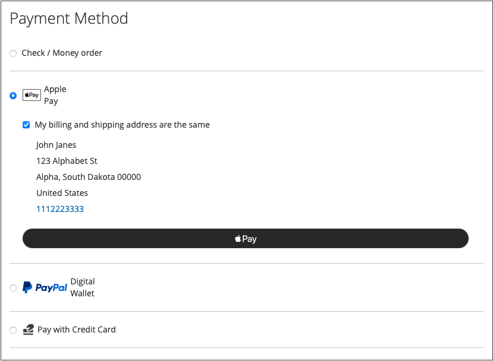
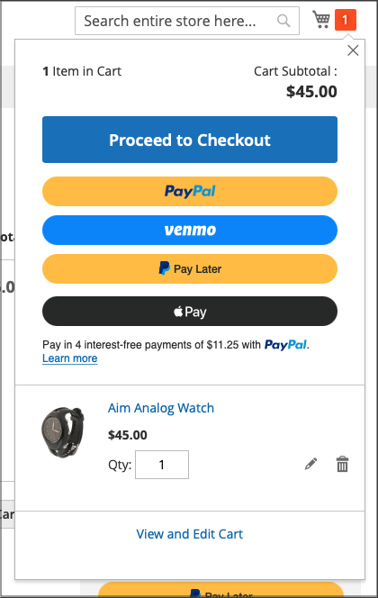

# 付款选项

通过[!DNL Adobe Commerce]和[!DNL Magento Open Source] [!DNL Payment Services]，您有多个可用的付款选项。

您可以在[主页设置](payments-home.md)或[商店配置](configure-admin.md)（建议用于旧版付款选项或多商店设置）中配置这些付款选项。

根据结账过程中的位置，每种支付方式都有不同的行为：

* 产品页 — 项目的产品页
* 迷你购物车 — 将产品添加到购物车后，单击购物车图标即可使用
* 购物车 — 在单击迷你购物车中的&#x200B;_查看并编辑购物车_&#x200B;时可用
* 签出视图 — 单击&#x200B;_后可用。从迷你购物车或购物车继续到签出_

>[!IMPORTANT]
>
>必须先完成[!DNL Payment Services]载入，然后才能处理付款。

## 标准支付体验与高级支付体验

[!DNL Payment Services]提供&#x200B;**高级**（完全支持）和&#x200B;**标准**（快速结帐）付款选项和登录流程，具体取决于您运营的国家/地区。

* **高级** — 所有可用的[付款选项](../payment-services/payments-options.md)都适用于当前[完全支持的国家/地区](../payment-services/overview.md#availability)。 在新用户引导以启用实时支付时，选择[高级用户引导选项](../payment-services/production.md#advanced-onboarding)。
* **Standard** — 付款选项（快速结帐）（PayPal信用卡和借记卡）的子集适用于其他受支持的国家/地区。 [信用卡字段](#credit-card-fields)和[Apple Pay](#apple-pay-button)不适用于此入门培训选项。 在新用户引导以启用实时支付时，选择[标准新用户引导选项](../payment-services/production.md#standard-onboarding)。

有关完成Advanced和Standard入门的信息，请参阅[为生产启用 [!DNL Payment Services] ](../payment-services/production.md#complete-merchant-onboarding)。

## [!UICONTROL Credit Card Fields]

[!UICONTROL Credit Card Fields]为信用卡或借记卡支付方式提供简单安全的结帐。 当购物者使用信用卡字段结账时，他们输入姓名、帐单地址以及信用卡或借记卡信息以下订单。 他们的客户信息在购买会话期间被安全地使用，以无缝地引导他们完成结账流程。

{width="500" zoomable="yes"}

为您的商店启用[信用卡保险存储](#vaulting)，以允许购物者保存其信用卡信息以便稍后快速结帐。

您可以在存储配置或[!DNL Payment Services]主页中配置[!UICONTROL Credit Card Fields]。 有关详细信息，请参阅[设置](settings.md#credit-card-fields)。

您还可以更改信用卡字段的布局、宽度、高度和外部样式。 有关详细信息，请参阅[PayPal文档](https://developer.paypal.com/docs/checkout/advanced/customize/card-field-style/)。

## [!DNL Apple Pay]按钮

客户可以使用存储在iOS或macOS设备上的信用卡和借记卡付款凭据的[[!DNL Apple Pay]](https://www.apple.com/apple-pay/)进行购买。

[!DNL Apple Pay]仅在Safari浏览器中可用。 商户在每个商户帐户中最多可以添加99个域。

迷你卡中的{width="500" zoomable="yes"}

[!DNL Apple Pay]按钮在产品页面、迷你购物车、购物车和结帐视图中可见。

若要将[!DNL Apple Pay]用于您的商店，请完成[使用 [!DNL Apple Pay]](https://developer.paypal.com/docs/checkout/apm/apple-pay/#register-your-live-domain)的自注册（_仅注册您的活动域_&#x200B;部分）并[在 [!DNL Payment Services]](settings.md#payment-buttons)中为您的商店配置它。

>[!NOTE]
>
> 请参阅PayPal开发人员文档中的[高级结帐](https://www.paypal.com/us/cshelp/article/what-is-paypal-advanced-checkout-and-how-do-i-get-started-help953){target=_blank}，了解如何让购买者能够在您的网站上使用Apple Pay付款。

您可以在商店配置或Payment Services主页中配置[!UICONTROL Apple Pay]。 有关详细信息，请参阅[设置](settings.md#apple-pay)。

## [!DNL Google Pay]按钮

客户可以通过将付款详细信息添加到其Google帐户来使用[[!DNL Google Pay]](https://pay.google.com/about/)，这些付款详细信息将安全地存储在该帐户中，以实现无缝结帐。

[!DNL Google Pay]仅在某些国家或地区以及在某些设备上可用。 有关详细信息，请参阅[[!DNL Google Pay] 文档](https://developer.paypal.com/docs/checkout/apm/google-pay/#link-googlepayintegration)。

结帐中的{width="500" zoomable="yes"}

[!DNL Google Pay]按钮在产品页面、迷你购物车、购物车和结帐视图中可见。

您可以在商店配置或Payment Services主页中配置[!UICONTROL Google Pay]。 有关详细信息，请参阅[设置](configure-admin.md)。

>[!NOTE]
>
> [!DNL Google Pay] API只能在安全上下文的网站上使用。 有关详细信息，请参阅[疑难解答](https://developers.google.com/pay/api/web/support/troubleshooting)文档。

## [!DNL PayPal Payment Buttons]

使用PayPal完成购买的[!DNL PayPal payment buttons]存储购物者的送货地址、帐单地址和付款详细信息，以供以后使用。 购物者可以使用PayPal以前存储或提供的任何支付方式。

{width="350" zoomable="yes"}

您可以在存储配置或[!DNL Payment Services]主页中配置[!UICONTROL PayPal payment buttons]。 有关详细信息，请参阅[设置](settings.md#payment-buttons)。

在PayPal的[付款方法文档](https://developer.paypal.com/docs/checkout/payment-methods/)中了解按国家/地区划分的付款方法可用性。

### [!DNL PayPal]按钮

客户可以使用PayPal按钮轻松自信地结帐。

[!DNL PayPal]按钮在产品页面、迷你购物车、购物车和结帐视图中可见。

### [!DNL Venmo]按钮

客户可以使用[Venmo](https://venmo.com/)按钮签出。

[!DNL Venmo]按钮在产品页面、迷你购物车、购物车和结帐视图中可见。

### PayPal借记或信用卡按钮

客户可以使用“PayPal借记”或“信用卡”按钮结帐。

从结账页面可见PayPal借记卡或信用卡按钮。

此选项可用于通过PayPal托管的按钮向购物者提供借记或信用卡支付选项，作为信用卡集成的替代方法。

### [!DNL Pay Later]按钮

为客户提供短期、免息付款和其他融资选项，以便他们现在购买并使用[!DNL Pay Later]按钮稍后付款。

[!DNL Pay Later]按钮在产品页面、迷你购物车、购物车和结帐视图中可见。

请参阅[PayPal的“以后付款优惠”文档](https://developer.paypal.com/docs/checkout/pay-later/us/)中有关“以后付款优惠”的信息。 使用&#x200B;**国家或地区**&#x200B;下拉菜单选择感兴趣的地区。

了解如何通过更新[设置](settings.md#payment-buttons)配置来禁用或启用[!DNL Pay Later]消息传送。

## 仅使用PayPal付款按钮

若要快速将商店设置为生产模式，您可以仅配置&#x200B;_个_ PayPal付款按钮（Venmo、PayPal等）。 — 而不使用PayPal信用卡支付选项。

这允许您：

* 为您的客户提供各种支付选项，包括Venmo和PayPal支付按钮，以及关闭PayPal托管卡字段并使用现有信用卡提供商的选项。
* 使用您现有的信用卡提供商进行信用卡支付，同时使用PayPal的其他支付选项。
* 在PayPal不支持将信用卡作为付款选项的地区，使用PayPal的付款按钮。

要&#x200B;**仅使用&#x200B;_捕获付款_ PayPal付款按钮（_不是_ PayPal信用卡付款选项）**：

1. 请确保您的存储在生产模式[&#128279;](settings.md#enable-payment-services)中为。
1. 在“设置”中[配置所需的PayPal付款按钮](settings.md#payment-buttons)。
1. 关闭&#x200B;_[!UICONTROL Payment buttons]_&#x200B;部分中的&#x200B;**[[!UICONTROL Show PayPal Credit and Debit card button]](settings.md#payment-buttons)**&#x200B;选项_&#x200B;关闭&#x200B;_。

要&#x200B;**使用现有信用卡提供商&#x200B;_和_ PayPal付款按钮**&#x200B;捕获付款：

1. 请确保您的存储在生产模式[&#128279;](settings.md#enable-payment-services)中为。
1. [配置所需的PayPal付款按钮](settings.md#payment-buttons)。
1. 关闭&#x200B;_[!UICONTROL Payment buttons]_&#x200B;部分中的&#x200B;**[[!UICONTROL PayPal Show Credit and Debit card button]](settings.md#payment-buttons)**&#x200B;选项_&#x200B;关闭&#x200B;_。
1. 关闭&#x200B;_[!UICONTROL Credit card fields]_&#x200B;部分中的_&#x200B;关闭&#x200B;_&#x200B;**[[!UICONTROL Show on checkout page]](settings.md#credit-card-fields)**&#x200B;选项，并使用您的[现有信用卡提供商帐户](https://experienceleague.adobe.com/docs/commerce-admin/stores-sales/payments/payments.html#payments)。

## 订单重新计算

当客户从迷你购物车、购物车或产品页面进入结账流程时，会被定向到订单审核页面，他们可以在PayPal弹出窗口中看到选定的送货地址。 在客户选择发运方法后，订单金额会适当重新计算，并且客户可以看到发运成本和税额。

当客户从结帐页面进入结帐流程时，系统已知道送货地址和最终计算金额，并且总计已正确显示。

免税期、运费和销售税可能因地点而异。 在[!DNL Payment Services]收到送货地址和运费后，它会快速重新计算所有适用的成本，并在结账的最后阶段适当地显示这些成本。

## 信用卡保险存储

购物者可以将其信用卡信息保存或“保存”，以便将来在网站级别（同一商家帐户内的任何商店）进行购买。

有关详细信息，请参阅[信用卡保险存储](vaulting.md)。

## 安全性

有关详细信息，请参阅[PCI合规性](security.md#pci-compliance)。
