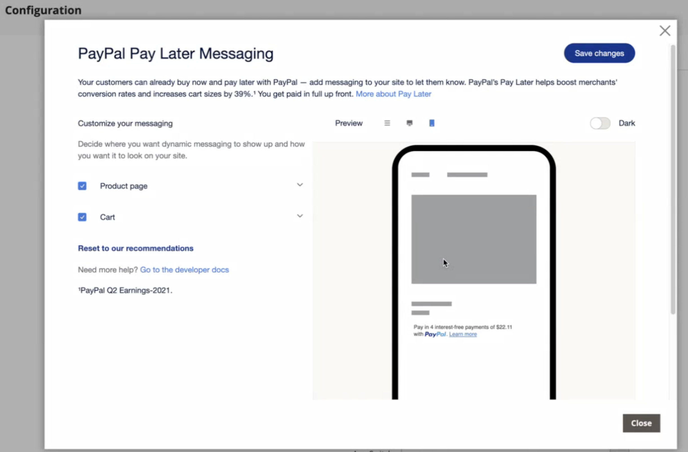

# 付款选项

通过[!DNL Adobe Commerce]和[!DNL Magento Open Source] [!DNL Payment Services]，您有多个可用的付款选项。

您可以在[主页设置](payments-home.md)或[商店配置](configure-admin.md)（建议用于旧版付款选项或多商店设置）中配置这些付款选项。

根据结账过程中的位置，每种支付方式都有不同的行为：

* 产品页 — 项目的产品页
* 迷你购物车 — 将产品添加到购物车后，单击购物车图标即可使用
* 购物车 — 在单击迷你购物车中的&#x200B;_查看并编辑购物车_&#x200B;时可用
* 签出视图 — 单击&#x200B;_后可用。从迷你购物车或购物车继续到签出_

>[!IMPORTANT]
>
>必须先完成[!DNL Payment Services]载入，然后才能处理付款。

## 标准支付体验与高级支付体验

[!DNL Payment Services]提供&#x200B;**高级**（完全支持）和&#x200B;**标准**（快速结帐）付款选项和登录流程，具体取决于您运营的国家/地区。

* **高级** — 所有可用的[付款选项](../payment-services/payments-options.md)都适用于当前[完全支持的国家/地区](../payment-services/introduction.md#availability)。 在新用户引导以启用实时支付时，选择[高级用户引导选项](../payment-services/production.md#advanced-onboarding)。

* **Standard** — 付款选项（快速结帐）（PayPal信用卡和借记卡）的子集适用于其他受支持的国家/地区。 [信用卡字段](#credit-card-fields)和[Apple Pay](#apple-pay-button)不适用于此入门培训选项。 在新用户引导以启用实时支付时，选择[标准新用户引导选项](../payment-services/production.md#standard-onboarding)。

有关完成Advanced和Standard入门的信息，请参阅[为生产启用 [!DNL Payment Services] &#x200B;](../payment-services/production.md#complete-merchant-onboarding)。

## [!UICONTROL Credit Card Fields]

[!UICONTROL Credit Card Fields]为信用卡或借记卡支付方式提供简单安全的结帐。 当购物者使用信用卡字段结账时，他们输入姓名、帐单地址以及信用卡或借记卡信息以下订单。 他们的客户信息在购买会话期间被安全地使用，以无缝地引导他们完成结账流程。

{width="500" zoomable="yes"}

## [!UICONTROL Digital Wallets]

### [!DNL Fastlane]按钮

[!DNL Fastlane]提供快速、安全且轻松的在线付款方式。 在&#x200B;**来宾结帐**&#x200B;期间，您可以安全地存储您的卡和运送详细信息，以便将来更快地进行购买。

* **即时访问经过验证的购物者**：识别数百万回头的客户，并在几秒钟内实现无缝支付。
* **提高收入**：通过更多已完成的购买来提高转化率和授权率。
* **加速签出**：使用安全、无密码的登录体验减少摩擦。

启用[!DNL Fastlane]后，[!UICONTROL Credit Card Fields]选项默认处于禁用状态。

>[!NOTE]
>
> 目前，仅美国商家支持Fastlane；因此，当前不支持[!UICONTROL 3D Secure authentication]。

有关详细信息，请参阅[Fastlane by PayPal](https://www.paypal.com/us/fastlane){target=_blank}主题。

### [!DNL Apple Pay]按钮

借助[!DNL Apple Pay]，商家可以在Safari中提供安全、简化的结账体验（每个商家帐户最多99个域），从而提高转化率。 “[!DNL Apple Pay]”按钮可自动填写从客户的iOS或macOS设备存储的付款、联系方式和送货详细信息，从而支持快速的一键结账体验。

迷你卡中的{width="500" zoomable="yes"}

启用后，[!DNL Apple Pay]按钮在产品页面、迷你购物车、购物车和结帐视图中可见。 您可以在存储配置或扩展的主目录中配置[!DNL Apple Pay]。

>[!NOTE]
>
>  Apple支付域验证证书已包含在支付服务代码中。 验证路径`/.well-known/apple-developer-merchantid-domain-association`是否返回200响应代码。 有关[Apple Pay域验证](https://developer.paypal.com/docs/checkout/apm/apple-pay/#download-and-host-sandbox-domain-association-file)证书的详细信息，请参阅有关与Apple Pay集成的&#x200B;**PayPal开发人员文档**。

有关详细信息，请参阅[设置](configure-admin.md#apple-pay)。

### [!DNL Google Pay]按钮

通过将[!DNL Google Pay]集成到您的结帐体验中，商家可以从购物者的Google帐户中收集保存的付款、联系和运送信息，从而跨受支持的浏览器和应用程序提供方便而简化的结帐。

[!DNL Google Pay]仅在某些国家或地区以及在某些设备上可用。 有关详细信息，请参阅[[!DNL Google Pay] 文档](https://developer.paypal.com/docs/checkout/apm/google-pay/#link-googlepayintegration)。

结帐中的{width="500" zoomable="yes"}

启用后，[!DNL Google Pay]按钮在产品页面、迷你购物车、购物车和结帐视图中可见。 有关详细信息，请参阅[设置](configure-admin.md)。

>[!NOTE]
>
> [!DNL Google Pay] API只能在安全上下文的网站上使用。 有关详细信息，请参阅[疑难解答](https://developers.google.com/pay/api/web/support/troubleshooting)文档。

### [!DNL PayPal Payment Buttons]

使用PayPal完成购买的[!DNL PayPal payment buttons]存储购物者的送货地址、帐单地址和付款详细信息，以供以后使用。 购物者可以使用PayPal以前存储或提供的任何支付方式。

{width="350" zoomable="yes"}

您可以在存储配置或[!UICONTROL PayPal payment buttons]主页中配置[!DNL Payment Services]。

在PayPal的[付款方法文档](https://developer.paypal.com/docs/checkout/payment-methods/)中了解按国家/地区划分的付款方法可用性。

#### [!DNL PayPal]按钮

客户可以使用PayPal按钮轻松自信地结帐。

[!DNL PayPal]按钮在产品页面、迷你购物车、购物车和结帐视图中可见。

#### [!DNL Venmo]按钮

客户可以使用[Venmo](https://venmo.com/)按钮签出。

[!DNL Venmo]按钮在产品页面、迷你购物车、购物车和结帐视图中可见。

#### PayPal借记或信用卡按钮

客户可以使用“PayPal借记”或“信用卡”按钮结帐。

从结账页面可见PayPal借记卡或信用卡按钮。

此选项可用于通过PayPal托管的按钮向购物者提供借记或信用卡支付选项，作为信用卡集成的替代方法。

#### [!DNL Pay Later]按钮

为客户提供短期、免息付款和其他融资选项，以便他们现在购买并使用[!DNL Pay Later]按钮稍后付款。

[!DNL Pay Later]按钮在产品页面、迷你购物车、购物车和结帐视图中可见。

请参阅PayPal开发人员文档中有关[稍后付款优惠](https://developer.paypal.com/docs/checkout/pay-later/us/)的信息。 使用&#x200B;**国家或地区**&#x200B;下拉菜单选择感兴趣的地区。

了解如何通过更新[!DNL Pay Later]设置[配置来禁用或启用](configure-admin.md#pay-later-button)消息传送。

##### 可选。 配置稍后付费消息

**为**&#x200B;稍后付款[配置消息传送](configure-admin.md#pay-later-button)允许商家修改此付款选项的默认样式。 如果您在&#x200B;**[!UICONTROL Display Pay Later Message]**&#x200B;设置`Yes`配置中将[设置为](configure-admin.md#pay-later-button)，则会显示&#x200B;**[!UICONTROL Configure Messaging]**&#x200B;模式按钮，以便您为&#x200B;**[!UICONTROL PayPal Pay Later messaging]**&#x200B;设置样式。

{width="500" zoomable="yes"}

### 仅使用PayPal付款按钮

若要快速将商店设置为生产模式，您可以仅配置&#x200B;_个_ PayPal付款按钮（Venmo、PayPal等）。 — 而不使用PayPal信用卡支付选项。

这允许您：

* 为您的客户提供各种支付选项，包括Venmo和PayPal支付按钮，以及关闭PayPal托管卡字段并使用现有信用卡提供商的选项。
* 使用您现有的信用卡提供商进行信用卡支付，同时使用PayPal的其他支付选项。
* 在PayPal不支持将信用卡作为付款选项的地区，使用PayPal的付款按钮。

要&#x200B;**仅使用&#x200B;_捕获付款_ PayPal付款按钮（_不是_ PayPal信用卡付款选项）**：

1. 请确保您的存储在生产模式[中为](configure-admin.md#enable-payment-services)。
1. 在“设置”中[配置所需的PayPal付款按钮](configure-admin.md#payment-buttons)。
1. 关闭&#x200B;_部分中的_&#x200B;选项&#x200B;**[[!UICONTROL Show PayPal Credit and Debit card button]](configure-admin.md#payment-buttons)**&#x200B;关闭&#x200B;_[!UICONTROL Payment buttons]_。

要&#x200B;**使用现有信用卡提供商&#x200B;_和_ PayPal付款按钮**&#x200B;捕获付款：

1. 请确保您的存储在生产模式[中为](configure-admin.md#enable-payment-services)。
1. [配置所需的PayPal付款按钮](configure-admin.md#payment-buttons)。
1. 关闭&#x200B;_部分中的_&#x200B;选项&#x200B;**[[!UICONTROL PayPal Show Credit and Debit card button]](configure-admin.md#payment-buttons)**&#x200B;关闭&#x200B;_[!UICONTROL Payment buttons]_。
1. 关闭&#x200B;_部分中的_&#x200B;关闭&#x200B;**[[!UICONTROL Show on checkout page]](configure-admin.md#credit-card-fields)** _[!UICONTROL Credit card fields]_&#x200B;选项，并使用您的[现有信用卡提供商帐户](https://experienceleague.adobe.com/docs/commerce-admin/stores-sales/payments/payments.html?lang=zh-Hans#payments)。

## 签出选项

通过[!DNL Payment Services]，您可以配置Adobe Commerce的结账体验，以最符合购物者的偏好和行为。 信用卡[保险存储](vaulting.md)和订单自动失效等功能可为您的客户确保无缝、轻松的交易。

使用Adobe Commerce和Magento Open Source [!DNL Payment Services]，您可以获得多个结账体验。 根据结账过程中的位置，每种支付方式都有不同的行为：

* 产品页面 — 项目的产品页面

* 迷你购物车 — 当产品已添加到购物车中时，单击购物车图标即可使用

* 购物车 — 在单击“查看”并从迷你购物车编辑购物车时可用

* 签出视图 — 单击“从迷你购物车或购物车转至签出”时可用

### 订单重新计算

当客户从迷你购物车、购物车或产品页面进入结账流程时，会被定向到订单审核页面，他们可以在PayPal弹出窗口中看到选定的送货地址。 在客户选择发运方法后，订单金额会适当重新计算，并且客户可以看到发运成本和税额。

当客户从结帐页面进入结帐流程时，系统已知道送货地址和最终计算金额，并且总计已正确显示。

免税期、运费和销售税可能因地点而异。 在[!DNL Payment Services]收到送货地址和运费后，它会快速重新计算所有适用的成本，并在结账的最后阶段适当地显示这些成本。

在[PayPal的付款方式](https://developer.paypal.com/docs/checkout/payment-methods/){target=_blank}文档中了解按国家/地区划分的付款方式可用性。
