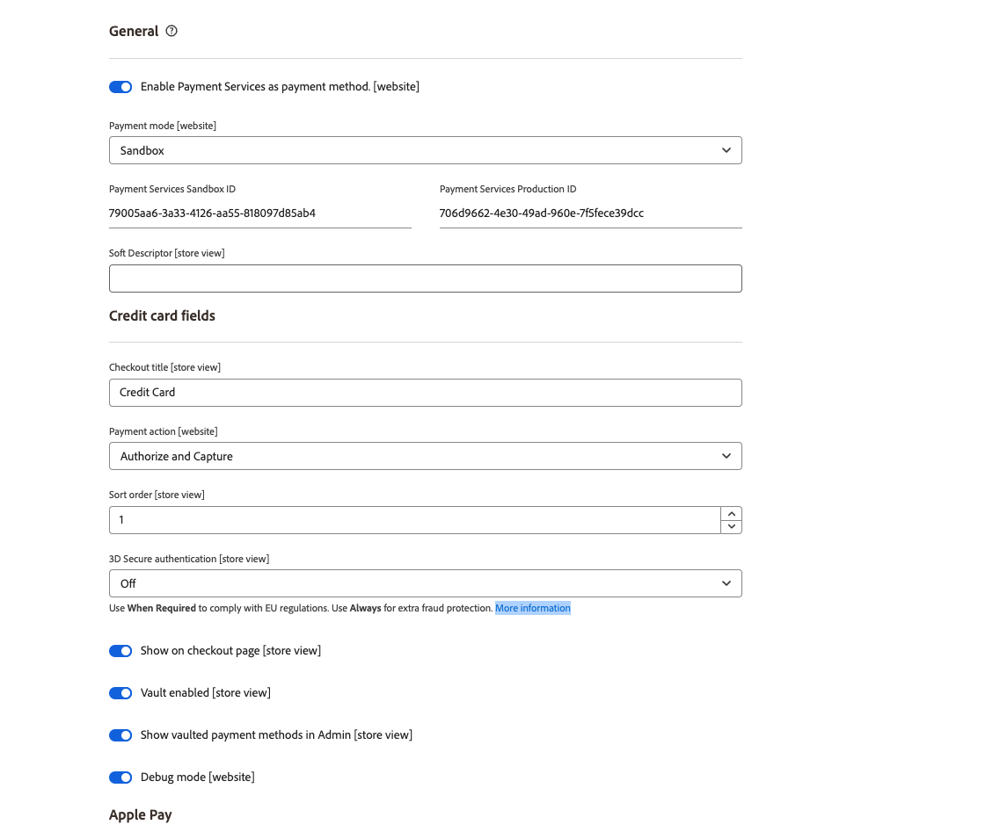

# 设置

您可以使用[!DNL Payment Services]主页中的有用设置根据需要自定义[!DNL Payment Services]。

要为[!DNL Adobe Commerce]和[!DNL Magento Open Source]配置[!DNL Payment Services]，请单击&#x200B;**[!UICONTROL Settings]**。 这些配置选项仅适用于在&#x200B;[_常规_&#x200B;配置选项](#configure-general-settings)的&#x200B;_[!UICONTROL Payment mode]_&#x200B;字段中设置的环境。

有关多存储或旧版配置，请参阅管理员中的[配置](configure-admin.md)。

## 配置常规设置

通过[!UICONTROL General]设置，您可以启用或禁用付款服务作为付款方式，并向客户交易添加信息以使用自定义信息标记网站或商店视图或为其添加前缀。

### 启用付款服务

您可以为网站启用[!DNL Payment Services]，并启用沙盒测试或实时付款。

1. 在&#x200B;_管理员_&#x200B;侧边栏上，转到&#x200B;**[!UICONTROL Sales]** > **[!UICONTROL Payment Services]**。

1. 单击&#x200B;**[!UICONTROL Settings]**。 有关详细信息，请参阅[ [!DNL Payment Services] 主页](payments-home.md)简介。

   {width="500" zoomable="yes"}

   _[!UICONTROL General]_&#x200B;部分包含用于启用[!DNL Payment Services]作为付款方式的设置。

1. 若要启用[!DNL Payment Services]作为商店的付款方式，请在&#x200B;_[!UICONTROL General]_&#x200B;部分中，将&#x200B;**[!UICONTROL Enable Payment Services as payment method]**&#x200B;切换为`Yes`。

1. 如果您仍在为应用商店测试[!DNL Payment Services]，请将&#x200B;**付款模式**&#x200B;设置为`Sandbox`。 如果您已准备好启用实时付款，请将其设置为`Production`。

1. 在设置[Commerce Services Connector](https://experienceleague.adobe.com/zh-hans/docs/commerce/user-guides/integration-services/saas){target=_blank}并首次访问[!DNL Payment Services]仪表板后，**[!UICONTROL Payment Services Sandbox ID]**&#x200B;和&#x200B;**[!UICONTROL Payment Services Production ID]**&#x200B;值将自动填充。 这样做以完成沙盒和/或生产环境的入门培训。 这些值将您的SaaS ID关联到[!DNL Payment Services]。

   >[!WARNING]
   >
   > 如果重置[!DNL Payment Services] ID，则必须重新载入。

1. 单击&#x200B;**[!UICONTROL Save]**。

   如果尝试离开此视图而不保存更改，会出现一个模式窗口，提示您放弃更改、继续编辑或保存更改。

1. 导航到&#x200B;**[!UICONTROL System]** > **[!UICONTROL Cache Management]**&#x200B;并单击&#x200B;**[!UICONTROL Flush Cache]**&#x200B;以刷新所有无效缓存。

您现在可以继续更改[付款选项](#configure-payment-options)功能和店面显示的默认设置。

### 添加软描述符

您可以将[!UICONTROL Soft Descriptor]添加到您的网站或单个商店视图配置。 客户交易银行对帐单上显示软描述符。 例如，如果您有多个商店/品牌/目录，则可以通过将自定义文本添加到[!UICONTROL Soft Descriptor]字段来轻松地在这些商店/品牌/目录之间进行描述。

1. 在&#x200B;_管理员_&#x200B;侧边栏上，转到&#x200B;**[!UICONTROL Sales]** > **[!UICONTROL Payment Services]**。
1. 单击&#x200B;**[!UICONTROL Settings]**。 有关详细信息，请参阅[ [!DNL Payment Services] 主页](payments-home.md)简介。
1. 在&#x200B;**[!UICONTROL Scope]**&#x200B;下拉菜单中选择要为其创建软描述符的网站或商店视图。 对于初始设置，将其保留为&#x200B;**[!UICONTROL Default]**&#x200B;以设置默认值。
1. 在文本字段中添加自定义文本（最多22个字符），替换`Soft descriptor`。
1. 单击&#x200B;**[!UICONTROL Save]**。
1. 要为网站或商店视图创建除已配置默认描述符之外的软描述符，请执行以下操作：
   1. 在&#x200B;**[!UICONTROL Scope]**&#x200B;下拉菜单中选择要为其创建软描述符的网站或商店视图。
   1. 切换&#x200B;_关_ **[!UICONTROL Use website]** （或&#x200B;**[!UICONTROL Use default]**，具体取决于您选择的范围）。
   1. 在文本字段中添加自定义文本。
   1. 单击&#x200B;**[!UICONTROL Save]**。
1. 要为网站或商店启用查看默认软描述符&#x200B;_或_&#x200B;用于父网站的软描述符：
   1. 在&#x200B;**[!UICONTROL Scope]**&#x200B;下拉菜单中选择要为其启用现有软描述符的网站或商店视图。
   1. 将&#x200B;_切换到_ **[!UICONTROL Use website]** （或&#x200B;**[!UICONTROL Use default]**，具体取决于您选择的范围）。
   1. 单击&#x200B;**[!UICONTROL Save]**。

   如果尝试离开此视图而不保存更改，会出现一个模式窗口，提示您放弃更改、继续编辑或保存更改。

### 配置选项

| 字段 | 范围 | 描述 |
|---|---|---|
| [!UICONTROL Enable] | 网站 | 为您的网站启用或禁用[!DNL Payment Services]。 选项： [!UICONTROL Off] / [!UICONTROL On] |
| [!UICONTROL Payment mode] | 商店视图 | 为存储设置方法或环境。 选项： [!UICONTROL Sandbox] / [!UICONTROL Production] |
| [!UICONTROL Payment Services Sandbox ID] | 商店视图 | 您的沙盒商家ID，在沙盒载入期间自动生成。 |
| [!UICONTROL Payment Services Production ID] | 商店视图 | 您的生产商家ID，在生产（实时）载入期间自动生成。 |
| [!UICONTROL Soft Descriptor] | 网站或商店视图 | 向您的网站和商店视图添加软描述符，以将信息添加到描述品牌、商店或产品线的客户交易。 [!UICONTROL Use website]切换将应用在网站级别添加的任何软描述符。 [!UICONTROL Use default]切换将应用添加为默认值的任何软描述符。 |

## 配置付款选项

现在您已经为网站启用了[!UICONTROL Payment Services]，您可以更改付款功能和店面显示的默认设置。

1. 在&#x200B;_管理员_&#x200B;侧边栏上，转到&#x200B;**[!UICONTROL Sales]** > **[!UICONTROL Payment Services]**。
1. 单击&#x200B;**[!UICONTROL Settings]**。 有关详细信息，请参阅[ [!DNL Payment Services] 主页](payments-home.md)简介。
1. 按照以下部分配置[信用卡](#credit-card-fields)、[付款按钮](#payment-buttons)和[按钮样式](#button-style)的付款选项。

### 信用卡字段

_[!UICONTROL Credit Card Fields]_&#x200B;设置为信用卡或借记卡支付方法提供了一个简单且安全的签出选项。

有关详细信息，请参阅[付款选项](payments-options.md#credit-card-fields)。

1. 在&#x200B;_管理员_&#x200B;侧边栏上，转到&#x200B;**[!UICONTROL Sales]** > **[!UICONTROL Payment Services]**。
1. 在&#x200B;**[!UICONTROL Scope]**&#x200B;下拉菜单中选择要为其启用付款方法的商店视图。
1. 在&#x200B;**[!UICONTROL Credit card fields]**&#x200B;部分中，编辑&#x200B;**[!UICONTROL Checkout title]**&#x200B;字段中的值以更改结帐期间显示的付款方法的名称。
1. 若要[设置付款操作](production.md#set-payment-services-as-payment-method)，请将&#x200B;**[!UICONTROL Payment action]**&#x200B;切换为`Authorize`或`Authorize and Capture`。
1. 要在结账页面上区分付款方法的优先级，请在&#x200B;**[!UICONTROL Sort order]**&#x200B;字段中提供`Numeric Only`值。
1. 要启用[3DS安全身份验证](security.md#3ds) （默认为`Off`）将&#x200B;**[!UICONTROL 3DS Secure authentication]**&#x200B;选择器切换为`Always`或`When required`。
1. 要启用或禁用签出页面上的信用卡字段，请切换&#x200B;**[!UICONTROL Show on checkout page]**&#x200B;选择器。
1. 要启用或禁用[卡保险存储](#card-vaulting)，请切换&#x200B;**[!UICONTROL Vault enabled]**&#x200B;选择器。
1. 若要启用或禁用Admin[&#128279;](#card-vaulting)中的保管式付款方法（商户使用保管式付款方法为管理员中的客户完成订单），请切换&#x200B;**[!UICONTROL Show vaulted methods in Admin]**&#x200B;选择器。
1. 要启用或禁用调试模式，请切换&#x200B;**[!UICONTROL Debug Mode]**&#x200B;选择器。
1. 单击&#x200B;**[!UICONTROL Save]**。

   如果尝试离开此视图而不保存更改，会出现一个模式窗口，提示您放弃更改、继续编辑或保存更改。

1. [刷新缓存](#flush-the-cache)。

#### 配置选项

| 字段 | 范围 | 描述 |
|---|---|---|
| [!UICONTROL Title] | 商店视图 | 在结帐期间在“付款方式”视图中添加文本，以显示此付款选项的标题。 选项： [!UICONTROL text field] |
| [!UICONTROL Payment Action] | 网站 | 指定付款方式的[付款操作](https://experienceleague.adobe.com/zh-hans/docs/commerce-admin/config/sales/payment-methods/payment-methods#payment-actions){target="_blank"}。 选项： [!UICONTROL Authorize] / [!UICONTROL Authorize and Capture] |
| [!UICONTROL Sort order] | 商店视图 | 结账页面上指定支付方式的排序顺序。 `Numeric Only`值 |
| [!UICONTROL 3DS Secure authentication] | 网站 | 启用或禁用[3DS安全身份验证](security.md#3ds)。 选项： [!UICONTROL Always] / [!UICONTROL When Required] / [!UICONTROL Off] |
| [!UICONTROL Show on checkout page] | 网站 | 启用或禁用要在结账页面上显示的信用卡字段。 选项： [!UICONTROL Off] / [!UICONTROL On] |
| [!UICONTROL Vault enabled] | 商店视图 | 启用或禁用[信用卡保险存储](vaulting.md)。 选项： [!UICONTROL Off] / [!UICONTROL On] |
| [!UICONTROL Show vaulted payment methods in Admin] | 商店视图 | 启用或禁用商家使用保管库付款方式[&#128279;](vaulting.md)为管理员中的客户完成订单的功能。 选项： [!UICONTROL Off] / [!UICONTROL On] |
| [!UICONTROL Debug Mode] | 网站 | 启用或禁用调试模式。 选项： [!UICONTROL Off] / [!UICONTROL On] |

### Apple Pay

“[!UICONTROL Apple Pay]”按钮付款选项允许您在Safari浏览器中商店的结账单中提供[!UICONTROL Apple Pay]付款按钮（每个商家帐户最多99个域）。

只有当您通过Paypal完成[Apple Pay自助注册](https://developer.paypal.com/docs/checkout/apm/apple-pay/#register-your-live-domain)，然后[为商店配置Apple Pay](settings.md/#payment-buttons)时，才能使用Apple Pay。 有关详细信息，请参阅[付款选项](payments-options.md#apple-pay-button)。

您可以启用和配置[!UICONTROL Apple Pay]按钮付款选项：

1. 在&#x200B;_管理员_&#x200B;侧边栏上，转到&#x200B;**[!UICONTROL Sales]** > **[!UICONTROL Payment Services]**。
1. 在&#x200B;**[!UICONTROL Scope]**&#x200B;下拉菜单中选择要为其启用付款方法的商店视图。
1. 在&#x200B;**[!UICONTROL Apple Pay]**&#x200B;部分中，编辑&#x200B;_[!UICONTROL Checkout title]_&#x200B;字段中的值以更改结帐期间显示的付款方法的名称。
1. 若要[设置付款操作](production.md#set-payment-services-as-payment-method)，请将&#x200B;**[!UICONTROL Payment action]**&#x200B;切换为`Authorize`或`Authorize and Capture`。
1. 要在结账页面上启用或禁用Apple Pay，请切换&#x200B;**[!UICONTROL Show Apple Pay on checkout page]**&#x200B;选择器。
1. 要在产品详细信息页面上启用或禁用Apple Pay，请切换&#x200B;**[!UICONTROL Show Apple Pay on product detail page]**&#x200B;选择器。
1. 要在迷你购物车预览上启用或禁用Apple Pay，请切换&#x200B;**[!UICONTROL Show Apple Pay on the mini cart preview]**&#x200B;选择器。
1. 要在购物车页面上启用或禁用Apple Pay，请切换&#x200B;**[!UICONTROL Show Apple Pay on cart page]**&#x200B;选择器。
1. 要启用或禁用调试模式，请切换&#x200B;**[!UICONTROL Debug Mode]**&#x200B;选择器。
1. 单击&#x200B;**[!UICONTROL Save]**。

   如果尝试离开此视图而不保存更改，会出现一个模式窗口，提示您放弃更改、继续编辑或保存更改。

1. [刷新缓存](#flush-the-cache)。

#### 配置选项

| 字段 | 范围 | 描述 |
|---|---|---|
| [!UICONTROL Checkout title] | 商店视图 | 在结帐期间在“付款方式”视图中添加文本，以显示此付款选项的标题。 选项： [!UICONTROL text field] |
| [!UICONTROL Payment Action] | 网站 | 指定付款方式的[付款操作](https://experienceleague.adobe.com/zh-hans/docs/commerce-admin/config/sales/payment-methods/payment-methods#payment-actions)。 选项： [!UICONTROL Authorize] / [!UICONTROL Authorize and Capture] |
| [!UICONTROL Show on checkout page] | 网站 | 启用或禁用“Apple支付”按钮以在结账页面上显示。 选项： [!UICONTROL Off] / [!UICONTROL On] |
| [!UICONTROL Show on checkout page] | 网站 | 启用或禁用“Apple支付”按钮以在产品详细信息页面上显示。 选项： [!UICONTROL Off] / [!UICONTROL On] |
| [!UICONTROL Show on mini cart preview] | 网站 | 启用或禁用“Apple支付”按钮以在迷你购物车预览中显示。 选项： [!UICONTROL Off] / [!UICONTROL On] |
| [!UICONTROL Show on cart page] | 网站 | 启用或禁用“Apple支付”按钮以在购物车页面上显示。 选项： [!UICONTROL Off] / [!UICONTROL On] |
| [!UICONTROL Debug Mode] | 网站 | 启用或禁用调试模式。 选项： [!UICONTROL Off] / [!UICONTROL On] |

### 付款按钮

[!DNL PayPal payment buttons]付款选项可为您的客户提供简单、快速和安全的结账过程。 有关详细信息，请参阅[付款选项](payments-options.md#paypal-smart-buttons)。

您可以启用和配置PayPal付款按钮付款选项：

1. 在&#x200B;**[!UICONTROL Scope]**&#x200B;下拉菜单中选择要为其启用付款方法的商店视图。
1. 若要更改结账期间显示的付款方式名称，请编辑&#x200B;**[!UICONTROL Checkout Title]**&#x200B;字段中的值。
1. 若要[设置付款操作](production.md#set-payment-services-as-payment-method)，请将&#x200B;**[!UICONTROL Payment action]**&#x200B;切换为`Authorize`或`Authorize and Capture`。
1. 要在结账页面上区分付款方法的优先级，请在&#x200B;**[!UICONTROL Sort order]**&#x200B;字段中提供`Numeric Only`值。
1. 使用切换选择器启用或禁用[!DNL PayPal smart button]显示功能：

   - **[!UICONTROL Show PayPal buttons on product checkout page]**
   - **[!UICONTROL Show PayPal buttons on product detail page]**
   - **[!UICONTROL Show PayPal buttons in mini-cart preview]**
   - **[!UICONTROL Show PayPal buttons on cart page]**
   - **[!UICONTROL Show PayPal Pay Later button]**
   - **[!UICONTROL Show PayPal Pay Later message]**
   - **[!UICONTROL Show Venmo button]**
   - **[!UICONTROL Show Apple Pay button]**
   - **[!UICONTROL Show PayPal Credit and Debit Card button]**

     >[!NOTE]
     >
     > 要使用Apple Pay，您[必须拥有Apple沙盒测试者帐户](https://developer.apple.com/apple-pay/sandbox-testing/#create-a-sandbox-tester-account)（包含虚假信用卡和帐单信息）才能对其进行测试。 当您准备好在沙盒&#x200B;_或_&#x200B;生产模式下使用Apple Pay时，完成任何[测试和验证](test-validate.md#test-in-sandbox-environment)后，向 [!DNL Apple Pay][&#128279;](https://developer.paypal.com/docs/checkout/apm/apple-pay/#register-your-live-domain)完成自助注册（_仅注册活动域_&#x200B;部分），并[在 [!DNL Payment Services]](settings.md#payment-buttons)中为您的商店配置它。

     当您打开/关闭付款按钮或PayPal Pay Later消息的可见性时，“设置”页面底部会显示该配置的可视预览。

1. 要启用调试模式，请切换&#x200B;**[!UICONTROL Debug Mode]**&#x200B;选择器。
1. 单击&#x200B;**[!UICONTROL Save]**。

   如果尝试离开此视图而不保存更改，会出现一个模式窗口，提示您放弃更改、继续编辑或保存更改。

1. [刷新缓存](#flush-the-cache)。

#### 配置选项

| 字段 | 范围 | 描述 |
|---|---|---|
| [!UICONTROL Title] | 商店视图 | 在结帐期间，在“付款方式”视图中添加要作为此付款选项的标题显示的文本。 选项：文本字段 |
| [!UICONTROL Payment Action] | 网站 | 指定付款方式的[付款操作](https://experienceleague.adobe.com/zh-hans/docs/commerce-admin/config/sales/payment-methods/payment-methods#payment-actions){target="_blank"}。 选项： [!UICONTROL Authorize] / [!UICONTROL Authorize and Capture] |
| [!UICONTROL Sort order] | 商店视图 | 结账页面上指定支付方式的排序顺序。 `Numeric Only`值 |
| [!UICONTROL Show PayPal buttons on checkout page] | 商店视图 | 在签出页面上启用或禁用[!DNL PayPal payment buttons]。 选项： [!UICONTROL &#x200B; Yes] / [!UICONTROL No] |
| [!UICONTROL Show PayPal buttons on product detail page] | 商店视图 | 在产品详细信息页面上启用或禁用[!DNL PayPal payment buttons]。 选项： [!UICONTROL &#x200B; Yes] / [!UICONTROL No] |
| [!UICONTROL Show PayPal buttons in mini-cart preview] | 商店视图 | 在迷你购物车预览中启用或禁用[!DNL PayPal payment buttons]。 选项： [!UICONTROL Off] / [!UICONTROL On] |
| [!UICONTROL Show PayPal buttons on cart page] | 商店视图 | 在购物车页面上启用或禁用[!DNL PayPal payment buttons]。 选项： [!UICONTROL Off] / [!UICONTROL On] |
| [!UICONTROL Show PayPal Pay Later button] | 商店视图 | 启用或禁用显示付款按钮的稍后付款选项外观。 选项： [!UICONTROL Off] / [!UICONTROL On] |
| [!UICONTROL Show PayPal Pay Later Message] | 网站 | 在购物车、产品页面、迷你购物车和结帐流程中启用或禁用“稍后付款”消息。 选项： [!UICONTROL Off] / [!UICONTROL On] |
| [!UICONTROL Show Venmo button] | 商店视图 | 启用或禁用显示付款按钮的Venmo付款选项。 选项： [!UICONTROL Off] / [!UICONTROL On] |
| [!UICONTROL Show Apple Pay button] | 商店视图 | 启用或禁用显示付款按钮的Apple支付付款选项。 选项： [!UICONTROL Off] / [!UICONTROL On] |
| [!UICONTROL Show PayPal Credit and Debit card button] | 商店视图 | 启用或禁用显示付款按钮的信用卡和借记卡付款选项。 选项： [!UICONTROL Off] / [!UICONTROL On] |
| [!UICONTROL Debug Mode] | 网站 | 启用或禁用调试模式。 选项： [!UICONTROL Off] / [!UICONTROL On] |

### 按钮样式

您还可以配置付款按钮的&#x200B;_[!UICONTROL Button style]_&#x200B;选项：

1. 要更改&#x200B;**[!UICONTROL Layout]**，请选择`Vertical`或`Horizontal`。

   >[!NOTE]
   >
   > 如果按钮样式配置为`Horizontal`并且您的商店配置为显示多个付款按钮，则您只能看到产品页面、结帐页面和迷你购物车上显示的两个按钮，以及购物车中显示的一个按钮。

1. 要在水平布局中启用标语，请切换&#x200B;**[!UICONTROL Show tagline]**&#x200B;选择器。
1. 要修改&#x200B;**[!UICONTROL Color]**，请选择所需的颜色选项。
1. 要修改&#x200B;**[!UICONTROL Shape]**，请选择`Pill`或`Rectangle`。
1. 要启用按钮高度选择器，请切换&#x200B;**[!UICONTROL Responsive button height]**&#x200B;选择器。
1. 要修改&#x200B;**[!UICONTROL Label]**，请选择所需的标签选项。

   当您更改布局、颜色、形状、高度和标签的配置选项时，该配置的可视预览会显示在“设置”页面的底部。 在下图中，**[!UICONTROL Shape]**&#x200B;设置为&#x200B;_矩形_，**[!UICONTROL Label]**&#x200B;设置为&#x200B;_PayPal（推荐）_。

   ![[!DNL PayPal payment buttons]选项](assets/payment-buttons.png){width="400" zoomable="yes"}

1. 单击&#x200B;**[!UICONTROL Save]**。

   如果尝试离开此视图而不保存更改，会出现一个模式窗口，提示您放弃更改、继续编辑或保存更改。

1. [刷新缓存](#flush-the-cache)。

您可以在Admin[&#128279;](configure-admin.md#configure-paypal-smart-buttons)的旧版配置中配置样式为的付款按钮，也可以在[!DNL Payment Services Home]中配置此按钮。 有关设置PayPal付款按钮样式的详细信息，请参阅[PayPal的按钮样式指南](https://developer.paypal.com/docs/checkout/standard/customize/buttons-style-guide/)。

#### 配置选项

| 字段 | 范围 | 描述 |
|--- |--- |--- |
| [!UICONTROL Layout] | 商店视图 | 定义付款按钮的布局样式。 选项： [!UICONTROL Vertical] / [!UICONTROL Horizontal] |
| [!UICONTROL Tagline] | 商店视图 | 启用/禁用标语。 选项： [!UICONTROL Off] / [!UICONTROL On] |
| [!UICONTROL Color] | 商店视图 | 定义付款按钮的颜色。 选项： [!UICONTROL Blue] / [!UICONTROL Gold] / [!UICONTROL Silver] / [!UICONTROL White] / [!UICONTROL Black] |
| [!UICONTROL Shape] | 商店视图 | 定义付款按钮的形状。 选项： [!UICONTROL Rectangular] / [!UICONTROL Pill] |
| [!UICONTROL Responsive Button Height] | 商店视图 | 定义付款按钮是否使用默认高度。 选项： [!UICONTROL Off] / [!UICONTROL On] |
| [!UICONTROL Height] | 商店视图 | 定义付款按钮的高度。 默认值：无 |
| [!UICONTROL Label] | 商店视图 | 定义付款按钮中显示的标签。 选项： [!UICONTROL PayPal] / [!UICONTROL Checkout] / [!UICONTROL Buynow] / [!UICONTROL Pay] / [!UICONTROL Installment] |

## 配置角色

为确保管理员用户可以在Commerce管理员中创建和管理订单，请为用户角色启用[!DNL Payment Services]特定资源。

请参阅[用户角色](https://experienceleague.adobe.com/docs/commerce-admin/systems/user-accounts/permissions-user-roles.html?lang=zh-Hans)以了解如何管理角色。

将资源分配给角色时，必须选择：

- **使用[!DNL Payment Services]**&#x200B;付款 — 此资源可确保当您在Admin中创建订单时，[!DNL Payment Services]信用卡可用作付款方式。 如果选择&#x200B;**操作**&#x200B;父资源，则也会选择此资源。
- **[!DNL Payment Services]** — 此资源包括&#x200B;**仪表板**&#x200B;和&#x200B;**SaaS服务代理**&#x200B;资源，也必须选择这些资源。 他们确保[!DNL Payment Services]出现在&#x200B;_Sales_&#x200B;菜单中。

  {width="400" zoomable="yes"}

## 刷新缓存

如果您在&#x200B;_设置_&#x200B;中更改配置，例如切换Apple Pay、Venmo或PayPal PayLater按钮，请手动刷新缓存，以便您的商店显示最新配置。

1. 在&#x200B;_管理员_&#x200B;侧边栏上，转到&#x200B;**[!UICONTROL System]** > **[!UICONTROL Cache Management]**。
1. 单击&#x200B;**[!UICONTROL Flush Cache]**&#x200B;以刷新所有无效缓存。

如果缓存管理表中的任何缓存类型具有`INVALIDATED`状态，则存储区可能不会显示该项目的最新配置。 刷新缓存以更新存储以显示最新配置。

为确保您的存储显示正确的配置，请定期[刷新缓存](https://experienceleague.adobe.com/zh-hans/docs/commerce-admin/systems/tools/cache-management)。

## 卡保险存储

您可以启用一些功能，使客户能够保存其“我的帐户”中的信用卡信息，以便将来购买时使用。

您也可以在“管理员”中使用卡保险存储来完成现有客户的后续订单。

在[信用卡字段设置](#credit-card-fields)中启用或禁用卡保险存储。

有关详细信息，请参阅[信用卡保险存储](vaulting.md)。

## 3DS

3DS可保护客户和商户免受其商店中的欺诈行为之害，并实现对欧盟(EU)标准的遵守。

在[信用卡字段设置](#credit-card-fields)中启用或禁用3DS。

有关详细信息，请参阅安全性[&#128279;](security.md#3ds)中的3DS。

## 使用多个PayPal帐户

在[!UICONTROL Payment Services]中，您可以在网站级别的&#x200B;**one**&#x200B;商家帐户中使用多个PayPal帐户。 例如，如果您在多个国家/地区经营您的商店（使用不同的[货币](https://experienceleague.adobe.com/zh-hans/docs/commerce-admin/stores-sales/site-store/currency/currency)），或者希望将Adobe Commerce用于业务的某些部分而非&#x200B;_所有_，您可以将商家帐户设置为使用多个PayPal帐户。

有关网站、商店和商店视图层次结构的详细信息，请参阅[网站、商店和视图范围](https://experienceleague.adobe.com/docs/commerce-admin/start/setup/websites-stores-views.html?lang=zh-Hans)。

有关通过CLI为多个PayPal帐户配置作用域的详细信息，请参阅[命令行配置](configure-cli.md#configure-scope-via-cli)。

您的销售代表可以为您的商家帐户创建新的[范围](https://experienceleague.adobe.com/docs/commerce-admin/start/setup/websites-stores-views.html?lang=zh-Hans#scope-settings)，并使用PayPal载入其他网站，以便您配置的任何PayPal按钮都将显示在您的网站上。 请与您的销售代表联系，以获得有关为网站使用多个PayPal帐户的帮助。
