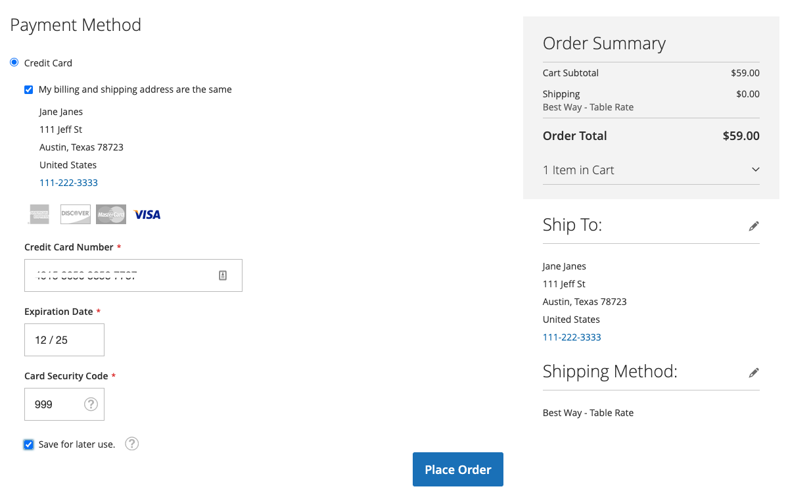

# 信用卡保险存储

通过信用卡保险存储将一次性购物者转化为忠诚客户。 登录的客户可以保存（或“保险库”）他们的信用卡凭据，以便在以后为同一商家帐户内的相同或其他商店购买时使用。

## 启用保险存储

商家可以在[!DNL Payment Services] [设置](settings.md#card-vaulting)中为他们的商店启用信用卡保险存储。

1. 在&#x200B;_管理员_&#x200B;侧边栏上，转到&#x200B;**[!UICONTROL Sales]** > **[!UICONTROL Payment Services]**。

1. 单击&#x200B;**[!UICONTROL Settings]**。

1. 切换&#x200B;**[!UICONTROL Vault enabled]**&#x200B;选择器。 有关详细信息，请参阅[启用 [!DNL Payment Services]](settings.md#enable-payment-services)。

## 无需购买即可保险存储

登录的客户可通过以下方式在&#x200B;**我的帐户**&#x200B;仪表板中保管付款方法：

1. 登录店面他们的&#x200B;**我的帐户**。

1. 在左侧导航中导航到&#x200B;**[!UICONTROL Stored Payment Methods]**&#x200B;以查看其所有存储的付款方法。

   有关详细信息，请参阅[存储的付款方式](https://experienceleague.adobe.com/en/docs/commerce-admin/stores-sales/payments/stored-payment-methods)。

1. 客户单击&#x200B;**[!UICONTROL Add New Card]**&#x200B;以存储新卡。

   {width="400" zoomable="yes"}

   客户必须提供所有必需的详细信息（如卡和帐单信息），以保存付款方法。
所有保险存储支付方法在保险存储卡（购物者的PayPal帐户中）时使用帐单地址集。 客户看到的账单地址可能与Commerce中显示的账单地址不同。

1. 单击&#x200B;**[!UICONTROL Save New Card]**

   {width="400" zoomable="yes"}

在下单时，存储卡可以使用：

{width="400" zoomable="yes"}

### 删除存储的支付方式

客户可以从&#x200B;**我的帐户**&#x200B;中的&#x200B;**存储支付方式**&#x200B;中轻松删除保险存储信用卡，方法是单击特定卡的&#x200B;**删除**。

## 在结账期间存储支付方式

登录的客户可以在结账期间保存信用卡，以便以后在当前商店或同一商家帐户内的其他商店中进行购买时使用：

{width="400" zoomable="yes"}

Commerce存储一个令牌，通过获取客户保存的信用卡信息来帮助他们完成未来的结账。 从客户帐户中或在结账期间保管卡将导致不同的付款令牌。

>[!WARNING]
>
> PayPal当前最多可以存储5张保险存储卡。

## 在管理员中使用保险存储

如果客户之前拥有保险存储信用卡，则商家可以使用任意这些保险存储支付方法在“管理员”中为该客户创建后续订单。

如果客户具有现有帐户，并且系统中存储了先前完成的付款的有效令牌，则您只能在管理员中使用保管卡。

要在“管理员”中使用保险存储信用卡为客户创建订单，请执行以下操作：

1. [创建订单并添加产品](https://experienceleague.adobe.com/docs/commerce-admin/stores-sales/point-of-purchase/assist/customer-account-create-order.html)。
1. 在&#x200B;_[!UICONTROL Payment & Shipping Information]_中，选择&#x200B;**[!UICONTROL Stored Cards]**作为付款方式。
1. 选择所需的保险存储信用卡支付方式。
1. 完成订单的任何其他必要步骤后，[提交订单](https://experienceleague.adobe.com/docs/commerce-admin/stores-sales/point-of-purchase/assist/customer-account-create-order.html?lang=en#step-3%3A-submit-the-order)。

   {width="600" zoomable="yes"}

## 安全性

与购物者共享最少信用卡信息；他们只能看到其保险存储信用卡的最后四位数字、过期日期和品牌。 信用卡信息与支付提供商一起存储，以满足[PCI](security.md#PCI-compliance)合规性标准。
