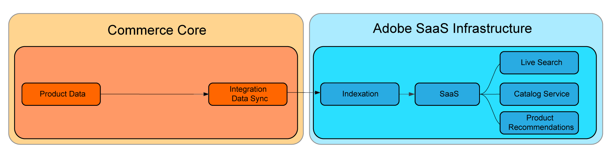

# SaaS价格索引

SaaS定价索引通过将资源密集型任务（如索引和价格计算）从Commerce应用程序转移到Adobe的云基础架构来优化站点性能。 此方式让商家能够快速扩展资源以加快价格指数化速度，并更快速地为店面及联接Commerce服务提供价格更新。

下图显示了当Commerce使用Commerce应用程序中包含的[价格索引](https://experienceleague.adobe.com/en/docs/commerce-operations/configuration-guide/cli/manage-indexers)流程时指向SaaS服务的索引数据流：


启用SaaS价格索引后，数据流会发生变化。 使用[Commerce SaaS数据导出](../data-export/sync-overview.md)执行价格索引。



所有商户都可以从使用SaaS价格索引中受益，但拥有以下特征的项目的商户可以实现最大的收益：

* **价格不断变化** — 需要重复更改价格以满足战略目标（如频繁促销、季节性折扣或库存减价）的商家。
* **多个网站和/或客户组** — 在多个网站（域/品牌）和/或客户组中共享产品目录的商家。
* **跨网站或客户组的许多唯一价格** — 具有广泛共享产品目录的商家，这些目录包含跨网站或客户组的唯一价格。 例如，B2B商家具有预先协商的价格或采用不同定价策略的品牌。

## 使用SaaS价格索引

安装Adobe Commerce Services时，会自动启用SaaS价格索引。 它支持计算所有内置Adobe Commerce产品类型的价格。

### 要求

* [Adobe Commerce](https://business.adobe.com/products/magento/magento-commerce.html) 2.4.4+。 有关详细信息，请参阅[系统要求](https://experienceleague.adobe.com/en/docs/commerce-operations/installation-guide/system-requirements){target="_blank"}。

### 先决条件

* 必须随最新版本的Commerce扩展安装以下Commerce服务之一：

  * [目录服务](../catalog-service/overview.md)
  * [实时搜索](../live-search/overview.md)
  * [产品推荐](../product-recommendations/guide-overview.md)

>[!NOTE]
>
>如果需要，可以使用[目录适配器](catalog-adapter.md)禁用Commerce应用程序中的默认价格索引器。

## 将价格与SaaS价格索引同步

为Adobe Commerce启用SaaS价格索引后，通过同步新信息源来更新店面和Commerce Services中的价格：

```bash
bin/magento saas:resync --feed=scopesCustomerGroup
bin/magento saas:resync --feed=scopesWebsite
bin/magento saas:resync --feed=prices
```

## 监视器同步进度

{{$include /help/_includes/data-export/verify-commerce-service-data-sync.md}}

必要时使用[Commerce CLI](../data-export/data-export-cli-commands.md)手动重新同步馈送。 有关重新同步选项和其他故障排除步骤，请参阅&#x200B;_SaaS Data Export Guide_&#x200B;中的[Manage synchronization](../data-export/data-sync-manage.md)。

>[!NOTE]
>
>要启用“数据馈送同步状态”页面（如果在Commerce Admin for Commerce on Cloud或内部部署中不可用），请按照[扩展安装说明](https://experienceleague.adobe.com/en/docs/commerce-admin/systems/data-transfer/data-sync/data-feed-sync-status#install-the-extension)操作。

## 自定义产品类型的价格

自定义产品类型（如基本、特殊、组和目录规则价格）支持价格计算。

如果您的自定义产品类型使用特定公式计算最终价格，则可以扩展产品价格信息源的行为。

1. 在`Magento\ProductPriceDataExporter\Model\Provider\ProductPrice`类中创建插件。

   ```xml
   <config xmlns:xsi="http://www.w3.org/2001/XMLSchema-instance"
           xsi:noNamespaceSchemaLocation="urn:magento:framework:ObjectManager/etc/config.xsd">
       <type name="Magento\ProductPriceDataExporter\Model\Provider\ProductPrice">
           <plugin name="custom_type_price_feed" type="YourModule\CustomProductType\Plugin\UpdatePriceFromFeed" />
       </type>
   </config>
   ```

1. 使用自定义公式创建方法：

   ```php
   class UpdatePriceFromFeed
   {
       /**
       * @param ProductPrice $subject
       * @param array $result
       * @param array $values
       *
       * @return array
       */
       public function afterGet(ProductPrice $subject, array $result, array $values) : array
       {
           // Override the output $result with your data for the corresponding products (see original method for details)
           return $result;
       }
   }
   ```
