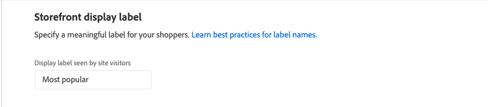
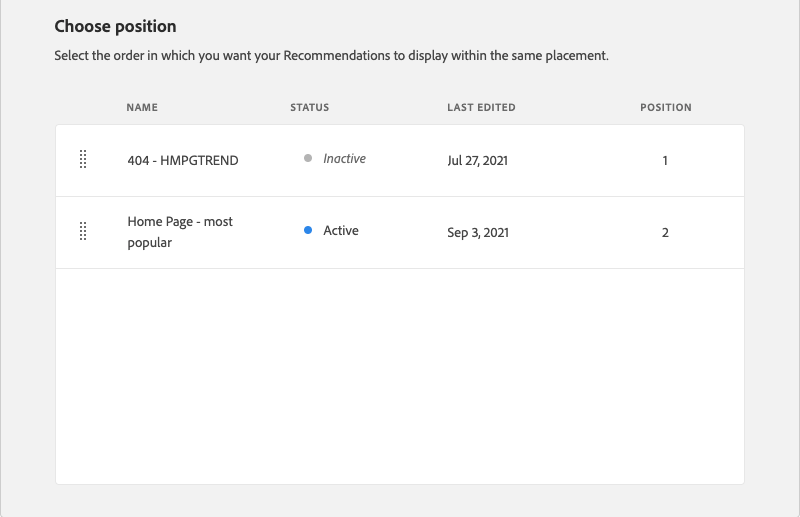

# 编辑推荐

通过“编辑推荐”页面，您可以调整构成推荐的各个设置。 除页面类型和推荐类型外，所有设置都可以编辑。 可以编辑以下设置：

- [推荐名称](#name)
- [店面标签](#label)
- [产品数量](#number)
- [版面和位置](#placement)
- [筛选产品](#filters)

页面右侧的预览显示具有当前设置的推荐如何在店面中显示。 向下滚动页面时，_推荐的产品预览_&#x200B;仍可见，以供参考。 预览可显示缩略图产品图像、产品名称、SKU、价格和返回每个产品的结果类型。 结果类型指示是否有足够的主要行为数据来生成推荐，或者它是否使用备份行为数据。

## 编辑推荐

1. 在&#x200B;_管理员_&#x200B;侧边栏上，转到&#x200B;**营销** > _促销活动_ > **产品推荐**。

1. 选择要编辑的建议。

1. 单击&#x200B;**编辑**。 然后，按照下面的说明进行所需的更改。

1. 完成后，单击&#x200B;**保存更改**。

### 推荐名称 {#name}

选择用于指示推荐目的的描述性名称。 该名称供内部参考，不会显示在店面中。

### 店面标签 {#label}

输入要用作店面中推荐单位的标签的文本。

### 产品数量 {#number}

调整滑块可在推荐单位中显示最多20个产品。

### 投放和位置 {#placement}

1. 选择推荐单元在店面中显示的页面位置。

   - 在主内容的底部
   - 在主内容的顶部

   

1. 要更改单元中包含的推荐的顺序，请使用&#x200B;**移动** 控件将推荐拖到适当位置。

   

### 筛选产品 {#filters}

对产品[过滤器](filters.md)所做的任何更改都会反映在&#x200B;_推荐的产品预览_&#x200B;中。 只允许推荐匹配包含过滤器的产品。 不建议使用与任何排除过滤器匹配的产品。

_排除项_&#x200B;和&#x200B;_排除项_&#x200B;选项卡列出了每种类型的可用筛选器。 在列表中，每个活动过滤器都标有一个蓝点。

- 要显示有关每个过滤器的详细信息，请单击过滤器名称。
- 要更改筛选器状态，请将&#x200B;**启用筛选器**&#x200B;切换开关设置为`on`或`off`位置。

过滤器设置描述了要在推荐单元中包含或排除的产品。 例如，_类别_&#x200B;筛选器包含设置告知系统仅包含选定类别中的产品。

