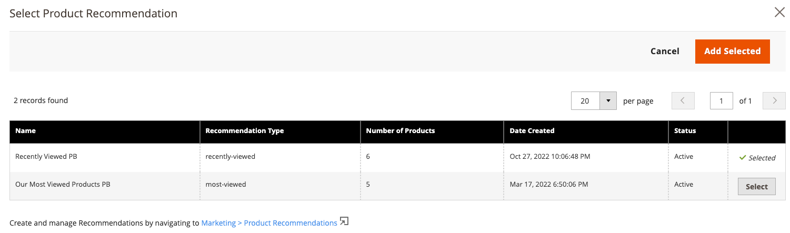

# [!DNL Page Builder]集成

“产品推荐”可以集成在您网站上部署的任何页面生成器内容中。

>[!NOTE]
>
> 在本地Page Builder页面上最多可以有25个推荐单元。 非本机页面生成器页面最多可以具有5个推荐单元。 有关详细信息，请参阅[新建推荐](create.md)。

## 将产品推荐与页面生成器内容结合使用

1. 在网站的默认商店视图中创建“推荐”单位。 即使您计划在不同商店视图中使用它们，也必须在默认商店视图中创建它们。

   >[!NOTE]
   >
   >Page Builder推荐单位的量度仅显示在默认的存储视图[!DNL Product Recommendations]工作区中。 即使您将页面生成器推荐单元放置在非默认商店视图的存储视图上，与这些页面生成器推荐单元相关的量度也不会显示在非默认商店视图[!DNL Product Recommendations]工作区中。 要在非默认存储视图[!DNL Product Recommendations]工作区上查看页面生成器量度，请打开并在非默认存储视图中编辑[页面生成器推荐单元](edit.md)，然后单击&#x200B;[!UICONTROL **保存**]。 Page Builder量度现在显示在[!DNL Product Recommendations]工作区的非默认storeview下。

1. 在页面生成器中，选择产品推荐内容小部件并放置在您的网站上。

1. 单击&#x200B;**编辑产品推荐**
1. 单击&#x200B;**选择**
1. 选择您之前创建的推荐单元，然后单击&#x200B;**添加选定项**

1. 对页面生成器内容进行任何其他编辑并保存更改。

在渲染时，推荐单元会遵循页面生成器内容的上下文和范围。
