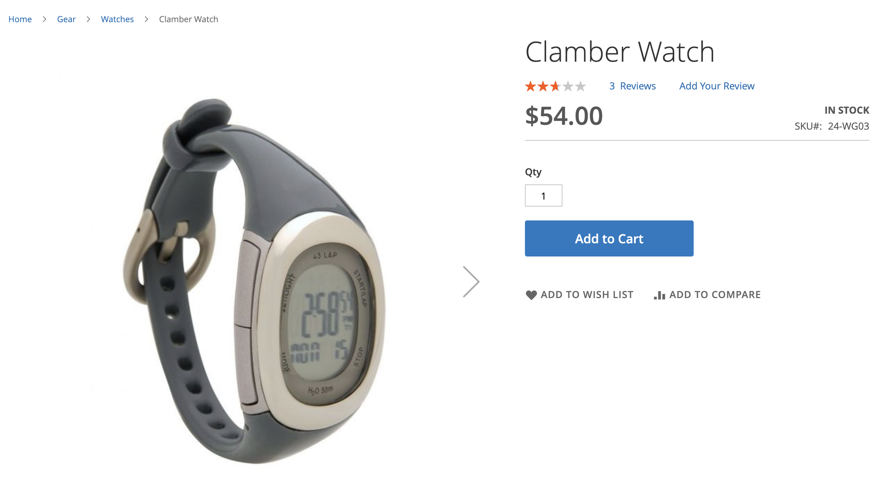
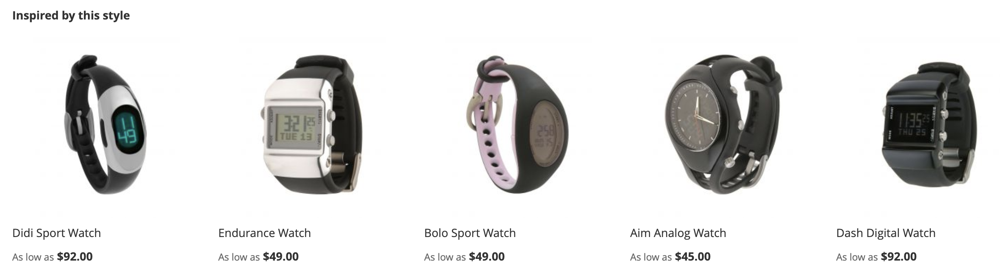

# 推荐类型

Adobe Commerce提供了一大批推荐，您可以将这些推荐部署到网站上的各个页面。 所有推荐类型都是数据驱动的。 行为数据、产品属性数据和量度可为它们提供支持。 为便于参考，建议类型按如下方式分组：

- [个性化](#personalized)
- [交叉销售和追加销售](#crossup)
- [热门程度](#popularity)
- [高性能](#highperf)

作为最佳实践，Adobe建议在使用推荐时遵循以下准则：

- 使推荐类型多样化。 如果客户反复建议相同的产品，则开始忽略推荐。

- 请勿将相同的推荐部署到购物车页面和订单确认页面。 请考虑将`Most Added to Cart`用于购物车页面，将`Bought This, Bought That`用于订单确认页面。

- 维护您的站点配置。 请勿在同一页面上部署三个以上的推荐单元。

- 如果您的商店销售服装，则`More like this`推荐可能会建议与正在查看的产品的性别不匹配的特定于性别的产品。 考虑仅对非服装类别使用此推荐类型。

>[!NOTE]
>
>有关本文中描述的事件的更多信息，请参阅开发人员文档中的[storefront事件](https://developer.adobe.com/commerce/services/shared-services/storefront-events/#product-recommendations)。

## 数据要求和行为

“产品推荐”是一个数据驱动系统，它依赖于从店面收集的行为数据。 推荐的质量和数量取决于可用的事件数据量。

>[!IMPORTANT]
>
>大多数推荐类型需要足够的行为数据（如产品查看、添加到购物车操作和购买）才能生成有意义的结果。 系统通常需要几天活跃的购物者活动才能构建准确的推荐。 要了解网站流量如何帮助填充各种推荐类型，请参阅[就绪指示器](create.md#readiness-indicators)。

### 数据不足时会出现什么情况

当没有足够的事件数据来生成推荐时，系统可以：

- 返回推荐单位的空结果。
- 触发[备份推荐](events.md#backup-recommendations)，例如在个性化推荐尚不可用时显示`Most viewed`产品。
- 在推荐单元中显示少于[配置的](create.md)的产品。

## 个性化 {#personalized}

这些推荐类型根据特定购物者在您网站上的行为历史记录推荐产品。 例如，如果购物者之前在您的网站上浏览或购买了一件夹克，则这些推荐将延续其之前的活动，并推荐其他夹克或类似产品。

>[!NOTE]
>
>个性化推荐要求购物者具有既定的行为历史。 没有足够交互历史记录的新访客或购物者会看到[备用推荐](events.md#backup-recommendations)，例如查看次数最多的产品，直到它们在您的网站上生成足够的行为信号为止。

| 类型 | 描述 |
|---|---|
| 为您推荐 | 根据每位购物者当前和之前的现场行为推荐产品。 根据购物者的浏览和购买历史记录显示高度相关的推荐。 此推荐类型在多数购物者开始访问网站的主页上有效。 对于您网站上首次购物且未生成任何信号来个性化体验的购物者，Adobe Commerce会根据查看次数最多的推荐类型显示产品。 但是，当购物者开始与网站上的产品进行交互时，推荐的产品会根据他们的行为实时进行调整。  **使用位置：**  — 主页  — 类别  — 页面生成器&#x200B;  **建议的标签：**  — 仅供您使用  — 为您推荐  — 受您的购物趋势启发 |
| 最近查看的项目 | 根据浏览器历史记录显示购物者最近查看的产品。 推荐单元会删除任何已删除的产品。 如果没有浏览器历史记录，或者在应用筛选规则时历史记录不足，则不会显示推荐单元。 如果结果包含的产品少于配置的数量，则推荐单元仅显示返回的产品。  **使用位置：**  — 主页  — 类别  — 产品详细信息  — 购物车  — 确认&#x200B;  **建议的标签：**  — 最近查看过的标签  — 再查看一次 |

## 交叉销售和追加销售 {#crossup}

这些推荐类型是社交性的，旨在帮助购物者找到其他人喜欢的东西。 它们还以产品为导向，帮助用户找到其他类似的产品。 推荐的产品通常与所选产品互补。

### 推荐的页面上下文

交叉销售和追加销售推荐类型使用显示推荐单位的页面的上下文。 该上下文告知系统在查找相关项目时要使用的产品或产品：

- **产品详细信息页面** — 使用购物者正在查看的产品的SKU。
- **购物车页面** — 使用购物车中产品的SKU。
- **订单确认页面** — 使用购物者完成的购买中的SKU。

根据部署位置，相同的推荐类型可能会产生不同的结果。 例如，*查看了这个项目，在产品详细信息页面上查看了*，将查看的产品用作上下文。 在购物车页面上，它使用购物车内容。 在订单确认页面上，它会使用已完成的订单。

>[!NOTE]
>
>“查看了这个项目，查看了那个项目，” “查看了这个，买了那个，”和“买了这个，买那个，”推荐类型使用复杂的协作过滤算法来识别&#x200B;_有趣的相似之处_，而不用过分强调流行产品。 该算法使用购物者在您网站上的多个会话中的聚合行为，而不是来自单个会话中交互的行为。 这些推荐类型可帮助购物者发现与其所查看的产品可能没有明显配对的相关产品。
>
>这些推荐类型需要大量跨产品交互数据来确定有意义的关联。 在足够的行为模式出现之前，产品目录多样性有限或流量较低的商店看到的推荐较少。

| 类型 | 描述 |
|---|---|
| 查看了这个项目，也查看了那个项目 | 推荐购物者查看次数与当前查看次数不成比例的产品。  **使用位置：**  — 产品详细信息  — 购物车  — 确认&#x200B;  **建议的标签：**  — 查看过此产品的客户也查看了(PDP) |
| 查看了这个项目，购买了那个项目 | 推荐消费者在查看当前产品后往往更频繁购买的产品。 这种类型有助于引导购物者发现在其他情况下他们可能没有注意到的产品。  **使用位置：**  — 产品详细信息  — 购物车  — 确认&#x200B;  **建议的标签：**  — 查看了这个项目的客户最终购买了  — 客户最终购买了  — 其他人查看了这个产品后会购买什么？ |
| 购买了此项，也购买了此项 | 推荐消费者经常购买与当前查看产品不成比例的产品。 此类型显示高度相关的产品，购物者可以通过汇总其他购物者随这些产品购买的内容，将其添加到购物车中。  **使用位置：**  — 产品详细信息  — 购物车  — 确认&#x200B;  **建议的标签：**  — 获取您需要的所有内容  — 不要忘记这些内容  — 经常一起购买 |
| 更多此类内容 | 推荐基于类似元数据（如名称、描述、类别分配和属性）的产品。 通过评估提供页面上下文的一个或多个产品的属性，此类型会推荐同一类别中的类似产品。 例如，如果购物者正在浏览瑜伽垫，则建议使用设备类别中的其他产品。 由于此推荐类型不区分性别，因此不建议服装、时尚或其他特定于性别的纵向市场。  **使用位置：**  — 产品详细信息  — 购物车  — 确认&#x200B;  **建议的标签：**  — 更多与此类似的产品  — 与此类似 |
| [视觉相似度](#visualsim) | 根据提供页面上下文的产品，推荐外观类似的产品。 如果产品的图像和视觉方面对购物体验很重要，则此推荐类型最有用。 |

## 热门程度 {#popularity}

这些推荐类型推荐的产品在过去七天内最受欢迎或最受欢迎。

>[!NOTE]
>
>基于热门程度的推荐需要您店面中的足够事件数据。 如果您的存储为新存储或低流量，则在收集到足够的行为数据之前，这些推荐类型会返回有限的结果或没有结果。 为确保获得最佳性能，请监视您的[数据就绪指示器](workspace.md)。

| 类型 | 描述 |
|---|---|
| 查看次数最多 | 推荐通过计算过去七天内发生查看操作的会话数查看次数最多的产品。  **使用位置：**  — 主页  — 类别  — 产品详细信息  — 购物车  — 确认  — 页面生成器&#x200B;  **建议的标签：**  — 最受欢迎  — 当前最受欢迎  — 当前最受欢迎  — 最近最受欢迎  — 受此产品(PDP)启发的热门产品  — 最畅销商品 |
| 购买次数最多 | 推荐过去7天内购物者最常购买的产品。  **使用位置：**  — 主页  — 类别  — 产品详细信息  — 购物车  — 确认  — 页面生成器&#x200B;  **建议的标签：**  — 最受欢迎  — 趋势  — 当前最受欢迎  — 最近最受欢迎  — 受此产品(PDP)启发的热门产品  — 最畅销商品 |
| 添加到购物车的次数最多 | 推荐购物者在过去七天内最常添加到购物车中的产品。 此推荐类型可在所有页面上使用。  **使用位置：**  — 主页  — 类别  — 产品详细信息  — 购物车  — 确认  — 页面生成器&#x200B;  **建议的标签：**  — 最受欢迎  — 趋势  — 当前最受欢迎  — 最近最受欢迎  — 受此产品(PDP)启发的热门产品  — 最畅销商品 |
| 趋势 | 根据最近七天内产品在网站上的受欢迎程度动态推荐产品。  Adobe AI会汇总您网站上的浏览和购买数据，以确定和排名哪些产品最近受购物者欢迎。 由于“趋势”分析的是近期产品发展势头，因此对于周转率较高的目录来说，它是一种有效的推荐类型。 如果您的目录比较静态，则除非受众的购物模式是高度可变的，否则它可能没有那么有用。  在主页上使用时，Trending会推荐最近在整个网站上都很受欢迎的产品。 潮流展示的产品不是一直很受欢迎的产品，而是最近才流行起来的产品。 例如，如果您有促销某些产品的电子邮件营销活动，则电子邮件产生的热门程度增加会增加促销产品被分类为趋势的可能性。  **使用位置：**  — 主页  — 类别  — 产品详细信息  — 购物车  — 确认  — 页面生成器&#x200B;  **建议的标签：**  — 趋势  — 当前趋势  — 最近趋势  — 热门产品  — 趋势相关产品(PDP) |

## 高性能 {#highperf}

这些推荐类型根据成功标准（如添加到购物车或转化率）推荐表现最好的产品。

>[!NOTE]
>
>高性能推荐类型依赖于转化数据（购买和添加到购物车操作）。 转化量低的新商店或商店需要在这些建议生效之前在7-14天内收集数据。

| 类型 | 描述 |
|---|---|
| 查看以购买转换 | 推荐具有最高购买转化率的产品。 在所有注册了产品查看的购物者会话中，最终注册购物者购买的份额是多少。  **使用位置：**  — 主页  — 类别  — 产品详细信息  — 购物车  — 确认&#x200B;  **建议的标签：**  — 最畅销商品  — 热门产品  — 您可能感兴趣的 |
| 查看到购物车的转换 | 推荐查看到购物车转化率最高的产品。 在所有注册了产品查看的购物者会话中，购物者最终注册添加到购物车的比例是多少。  **使用位置：**  — 主页  — 类别  — 产品详细信息  — 购物车  — 确认&#x200B;  **建议的标签：**  — 最畅销商品  — 热门产品  — 您可能感兴趣 |

## 视觉相似度 {#visualsim}

_视觉相似度_&#x200B;推荐类型建议外观与正在查看的产品相似。 当产品的图像和视觉方面是购物体验的重要部分时，此推荐类型最有用。

### 工作原理

_视觉相似度_&#x200B;推荐类型为您的目录中与当前正在查看的图像具有视觉相似度的其他产品提供推荐。 视觉相似性包括如下几个方面：

- 颜色
- 形状
- 大小
- 纹理
- 材料
- 样式

Adobe AI使用AI处理和分析目录中的图像，并构建用于确定视觉相似性的属性。

>[!NOTE]
>
> 如果您在非生产环境中测试此推荐类型，请确保您的图像URL可公开访问。

>[!NOTE]
>
> 目前，产品映像的大小必须等于或小于10 MB。

由于此推荐类型不适用于大多数目录，因此默认情况下，系统不会启用它。 明确启用此推荐类型。

### 启用视觉相似性推荐类型

>[!NOTE]
>
> 将&#x200B;_视觉相似度_&#x200B;推荐类型作为可选模块[安装](install-configure.md)时，该推荐类型可用。

1. 在&#x200B;_管理员_&#x200B;侧边栏上，转到&#x200B;**营销** > _促销活动_ > **产品推荐**&#x200B;以显示&#x200B;_产品推荐_&#x200B;仪表板。

1. 单击&#x200B;**设置**（齿轮图标）以显示&#x200B;_设置_&#x200B;页面。

1. 在&#x200B;_可视化推荐_&#x200B;部分中，选择&#x200B;**启用可视化推荐**。

1. 完成后，单击&#x200B;**保存更改**。

   当页面类型为&#x200B;**产品详细信息**&#x200B;时，[新建推荐](create.md)页面现在将&#x200B;**视觉相似度**&#x200B;显示为可选推荐类型。

启用可视化推荐后，Adobe AI将启动图像处理。 所需时间取决于目录的大小。

### 使用处

- 产品详细信息

### 建议的店面标签

- 您可能还喜欢
- 我们找到了您可能喜欢的其他产品
- 受此风格启发

### 示例

下图显示了&#x200B;_Clamber Watch_&#x200B;的产品详细信息页面：

以下显示了&#x200B;_Clamber监视_&#x200B;的&#x200B;_视觉相似度_&#x200B;推荐单位：

