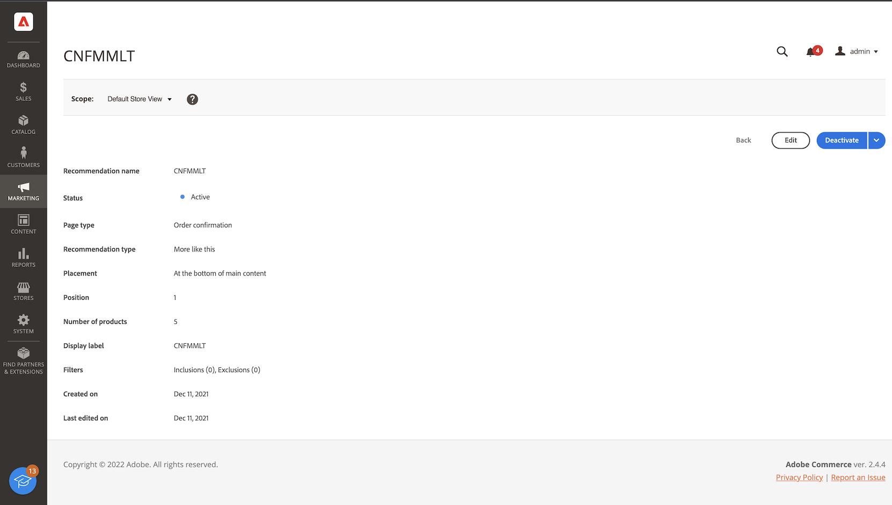

# [!DNL Product Recommendations] Workspace

[!DNL Product Recommendations]工作区显示以前配置的推荐列表，其中包含可帮助您跟踪每个推荐是否成功的量度。 可将该列表配置为计算过去一天、一周或月的量度。 您可以使用量度，根据查看或单击推荐单位的频率创建切实可行的见解，或分析推荐的执行情况。

>[!INFO]
>
>推荐单元是包含推荐的产品&#x200B;_项目_&#x200B;的构件。

_推荐Workspace_

## 数据收集

要确保工作区上的每个功能区域都包含正确的数据，您需要根据选定的店面实施配置数据收集：

1. Luma — 数据收集现成可用。
1. Headless — 根据店面实施，必须手动配置数据收集。

如果您使用的是Headless店面，请参阅以下文档以获得有关需要添加的事件的更多信息：

- 产品推荐仪表板的[必需事件](events.md)。
- 需要添加为先决条件的[店面事件收集器](https://developer.adobe.com/commerce/services/shared-services/storefront-events/collector/)。
- 事件结构的[示例](https://github.com/adobe/commerce-events/tree/main/examples)。

## 设置范围

最初，所有推荐设置的[范围](https://experienceleague.adobe.com/docs/commerce-admin/start/setup/websites-stores-views.html?lang=zh-Hans)设置为`Default Store View`。 如果您的Commerce安装包含多个存储视图，请将&#x200B;**范围**&#x200B;设置为您的建议适用的[存储视图](https://experienceleague.adobe.com/docs/commerce-admin/start/setup/websites-stores-views.html?lang=zh-Hans#scope-settings)。

## 设置量度日期范围

1. 单击&#x200B;**日历** 控件。

1. 选择下列选项之一：

   - 最近24小时
   - 最近7天
   - 最近30天

   量度列中的计算值会发生更改，以反映当前日期范围。

   >[!NOTE]
   >
   >产品推荐量度已针对Luma店面进行了优化。 如果您的店面不基于Luma，则量度跟踪数据的方式取决于您[如何实施事件收集](events.md)。

## 显示/隐藏列

1. 单击左上角的&#x200B;**显示/隐藏** 列。

   可见的列具有蓝色复选标记。

1. 在菜单中，执行以下任一操作：

   - 要显示隐藏的列，请单击任何不带复选标记的列名称。
   - 要隐藏可见列，请单击带有复选标记的任何列名称。

   将刷新表以仅包含选定的列。

   
   _显示/隐藏列_

## 设置

这些设置确定提供推荐行为数据的SaaS数据空间。

- 要更改推荐行为数据的来源位置，请选择其他SaaS数据空间。

- 要配置新的SaaS数据空间，请单击&#x200B;**编辑配置**。 若要了解详细信息，请参阅[设置](settings.md)。

_推荐设置_

## 查看详细信息

1. 在表中，单击要检查的建议案。

   
   _主页转化率详细信息_

1. 要更改推荐的状态，请单击&#x200B;**激活**&#x200B;或&#x200B;**停用**。

## 编辑推荐

在推荐详细信息页面中，单击&#x200B;**编辑**。 若要了解详细信息，请转到[编辑推荐](edit.md)。

## 创建推荐

在推荐详细信息页面中，单击&#x200B;**创建**。 若要了解详细信息，请转到[创建推荐](create.md)。

## Workspace控件

| 控件 | 描述 |
|---|---|
|  | 确定用于量度计算的时间范围。 选项：24小时/7天/30天 |
|  | 确定[!DNL Product Recommendations]表中显示的列。 |
| 设置 | 确定从中获取推荐行为数据的SaaS数据空间，还启用视觉相似性推荐类型。 |
| 创建推荐 | 打开[新建推荐](create.md)页面。 |

## 列说明

| 列 | 描述 |
|---|---|
| 名称 | 推荐的名称。 |
| 页面 | 显示推荐的页面。 |
| 类型 | 推荐类型。 |
| 状态 | 推荐状态。 选项：不活动/活动/草稿 |
| 已创建 | 创建推荐的日期。 |
| 上次编辑时间 | 上次编辑推荐的日期。 |
| 展示次数 | 在页面上加载和呈现推荐单元的次数。 位于浏览器视区折叠下方的推荐单元将在页面上呈现，即使购物者未查看也是如此。 在这种情况下，呈现的单位被计为一次展示，但只有在购物者将单位滚动到观看中时才计为一次观看。 |
| 展示次数 | （可视展示次数）注册至少一个视图的推荐单元数。 例如，如果推荐单元有两行，每行具有两个产品，并且购物者看不到后两个产品，但前两个产品是，则活动仍会计为一次展示。 |
| 视图 | 购物者浏览器视区中显示的推荐单位数。 如果购物者多次向上或向下滚动页面，则事件会触发多次，而每次都可以查看设备。 |
| 点击次数 | 购物者点击推荐单元中项目的次数与购物者点击推荐单元中&#x200B;**添加到购物车**&#x200B;按钮的次数之和 |
| 收入 | 在当前时间范围内由推荐驱动的收入。 |
| Lt收入 | （生命周期收入）由推荐驱动的生命周期收入。 |
| 可见性 | 注册查看的推荐单元的百分比。 |
| CTR | （点进率）注册一次点击的推荐的单位展示次数百分比。 CTR会计算所有展示，即使设备未进入购物者的视图。 如果未查看推荐单元，则不太可能单击该单元。 但是，这些不可见的展示计为CTR分数，并降低了总体CTR百分比。 |
| vCTR | （可视点进率）仅根据可视展示（实际出现在购物者屏幕可视部分的推荐）来测量点击次数，从而更准确地衡量购物者参与度。 |
