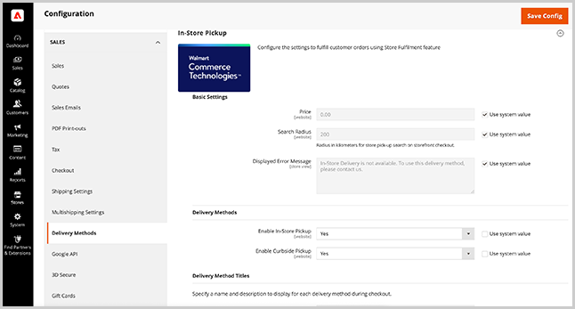

# 商店服务和销售配置

通过配置扩展设置、“商店助手”应用程序用户的安全设置以及传递方法选项，从[!DNL Commerce]管理员中启用[!DNL Store Fulfillment]扩展。

>[!IMPORTANT]
>
>应用商店履行服务配置仅在您连接Adobe Commerce实例和[!DNL Store Fulfillment]应用程序之后适用。 请参阅[Connect Store履行](connect-set-up-service.md)。

## 管理商店履行服务设置

从[!DNL Commerce Admin Store Configuration]菜单管理存储履行服务的设置。

- 通过选择&#x200B;**[!UICONTROL Stores > Configuration > Services > Store Fulfillment by Walmart Commerce Technologies]**，启用该扩展、配置全局设置并指定Store Assist应用用户连接和帐户的安全选项。

  商店履行的

- 通过选择&#x200B;**[!UICONTROL Store > Configuration > Sales > Delivery Methods > In-Store Pickup]**&#x200B;配置投放方法。

  

## 基本设置

<table>
<thead>
<tr>
<td><strong>字段</strong></td>
<td><strong>描述</strong></td>
<td><strong>范围</strong></td>
<td><strong>必填</strong></td>
</tr>
</thead>
<tbody>
<tr>
<td><strong>[!UICONTROL Price]</strong></td>
<td>您向客户收取店内取货的价格。 默认为零。</td>
<td>网站</td>
<td>否</td>
</tr>
<tr>
<td><strong>[!UICONTROL Search Radius]</strong></td>
<td>购物者在店面结帐时搜索商店提货位置时使用的半径（以公里为单位）。 搜索结果仅返回位于指定搜索半径内的存储。</td>
<td>网站</td>
<td>否</td>
</tr>
<tr>
<td><strong>[!UICONTROL Displayed error message]</strong></td>
<td>当客户为不可用于店内提货的项目选择店内提货时显示的消息。 如果需要，可以自定义默认文本。
</td>
<td>商店视图</td>
<td>否</td>
</tr>
</tbody>
</table>

>[!NOTE]
>
>[!UICONTROL Search Radius]设置仅在您为Adobe Commerce配置了[存储位置和映射设置](store-location-map-provider-setup.md)时使用。

## 启用“商店履行”解决方案

启用[!DNL Store Fulfillment]解决方案以将店内和路边取货功能添加到您Adobe Commerce店面的购物和结帐体验中。

<table>
<thead>
<tr>
<td><strong>字段</strong></td>
<td><strong>描述</strong></td>
<td><strong>范围</strong></td>
<td><strong>必填</strong></td>
</tr>
 </thead>
 <tbody>
<tr>
<td><strong>[!UICONTROL Enabled]</strong></td>
<td>启用或禁用解决方案。 启用后，配置并使用商店履行功能，并在Adobe Commerce商店与[!DNL Store Fulfillment]服务之间建立连接。 禁用后，所有“商店履行”功能都将禁用，并且Adobe Commerce与“商店履行”服务之间不会进行通信。 无法处理或接收订单信息。</td>
<td>网站</td>
<td>是</td>
</tr>
</tbody>
</table>

## 添加帐户凭据

<table>
<tr>
<td><strong>字段</strong></td>
<td><strong>描述</strong></td>
<td><strong>范围</strong></td>
<td><strong>必填</strong></td>
</tr>
<tr>
<td><strong>[!UICONTROL Environment]</strong></td>
<td>选择<i>[!UICONTROL Sandbox]</i>或<i>[!UICONTROL Production]</i>  选择[!UICONTROL Sandbox]可在测试环境中启用与履行服务的通信。  选择[!UICONTROL Production]可在实时环境中启用与履行服务的通信。  您获得了每个环境的一组凭据，可以在同一安装中管理这两个组。   在验证连接之前保存凭据。</td>
<td>全局</td>
<td>是</td>
</tr>
<tr>
<td><strong>[!UICONTROL API Server URL]</strong></td>
<td>Walmart Store Fulfillment API端点的URL。 该值必须是新用户引导过程中提供的完全限定的URL。 存储履行客户将同时收到沙盒和生产URL。 添加值时，请确保复制并粘贴完整的URL，包括结尾斜杠“/”。</td>
<td>全局</td>
<td>是</td>
</tr>
<tr>
<td><strong>[!UICONTROL Token Auth Server URL]</strong></td>
<td>Walmart Store Fulfillment身份验证端点的URL。 该值必须是新用户引导过程中提供的完全限定的URL。 您同时会收到沙盒和生产URL。 添加值时，请确保复制并粘贴完整的URL，包括结尾斜杠“/”。</td>
<td>全局</td>
<td>是</td>
</tr>
<tr>
<td><strong>[!UICONTROL Merchant Id]</strong></td>
<td>您在载入流程中提供的唯一商家（租户）ID。 此ID用于发送订单，以确保您的商家商店接收这些订单。</td>
<td>全局</td>
<td>是</td>
</tr>
<tr>
<td><strong>[!UICONTROL Consumer Id]</strong></td>
<td>在新用户引导过程中提供的唯一集成ID。 此ID用于验证Adobe Commerce和商店履行服务之间的所有通信</td>
<td>全局</td>
<td>是</td>
</tr>
<tr>
<td><strong>[!UICONTROL Consumer Secret]</strong></td>
<td>在新用户引导过程中提供的唯一集成密钥。 此密钥用于验证Adobe Commerce与商店履行服务之间的所有通信。</td>
<td>全局</td>
<td>是</td>
</tr>
</table>

配置[!UICONTROL Account Credentials]后，选择<strong>[!UICONTROL Validate Credentials]</strong>以首次验证并建立与存储履行服务的连接。

## 配置日志记录

存储履行服务的日志在日志文件`var/log/walmart-bopis.log`中可用。

要求系统管理员将您的环境配置为允许例外处理，以便通过防火墙或缓存来捕获与API相关的例外。

由于应用程序日志文件可以快速增大，因此只有在需要时才为应用程序启用日志记录，例如，在排查[!DNL Commerce]订单的存储履行问题时。 此配置可防止因大型日志文件而导致生产环境中的响应时间问题。

>[!TIP]
>
>对于Adobe Commerce内部部署，请要求系统管理员为`var/log/walmart-bopis.log`文件设置日志轮换以最小化大小。 有关Adobe Commerce内部部署安装，请参阅&#x200B;_Adobe Commerce安装指南_&#x200B;中的[日志轮换](https://experienceleague.adobe.com/docs/commerce-operations/installation-guide/next-steps/configuration.html?lang=zh-Hans#server-settings)。 有关云基础架构项目上的Adobe Commerce，请参阅[查看和管理日志](https://experienceleague.adobe.com/docs/commerce-cloud-service/user-guide/develop/test/log-locations.html?lang=zh-Hans)。

<table>
<thead>
<tr>
<td><strong>字段</strong></td>
<td><strong>描述</strong></td>
<td><strong>范围</strong></td>
<td><strong>必填</strong></td>
</tr>
</thead>
<tbody>
<tr>
<td><strong>[!UICONTROL Debug Mode]</strong></td>
<td>调试模式用于增加集成中记录的活动。 禁用后，不会记录任何调试信息。 启用后，将记录所有调试信息  所有记录的数据都可以在文件中找到： <pre>var/log/walmart-bopis.log</pre>
<td>全局</td>
<td>否</td>
</tr>
</tbody>
</table>

## 管理订单同步

配置设置以管理订单同步的错误处理、在订单领料期间用于条形码扫描的目录属性，以及配置商店履行队列的订单批量。

您可以在“管理员”(
<strong>[!UICONTROL System > Tools > Store Fulfillment Queue]</strong>)。

### 同步错误管理

<table>
<tr>
<td><strong>字段</strong></td>
<td><strong>描述</strong></td>
<td><strong>范围</strong></td>
<td><strong>必填</strong></td>
</tr>
<tr>
<td><strong>[!UICONTROL Retry Critical Error]</strong></td>
<td>指定发生严重错误后对记录同步操作的重试尝试。  只要集成无法从履行服务获得积极响应，就会出现严重错误。 当服务关闭或发送订单数据时出现错误时，就会出现这些问题。  达到重试阈值时，该项将保留在队列中，但不会再次处理。 在管理员中从<strong>[!UICONTROL System > Tools > Store Fulfillment Queue]</strong>管理查看所有有错误的项目。 要诊断持续失败的项目，请联系您的客户经理。</td>
<td>全局</td>
<td>否</td>
</tr>
<tr>
<td><strong>[!UICONTROL Enable Error Notification Email]</strong></td>
<td>启用错误通知，以便在到达订单的[!UICONTROL Retry Critical Error Threshold]时接收电子邮件。 通知包含有关错误的任何可用详细信息。</td>
<td>全局</td>
<td>否</td>
</tr>
<tr>
<td><strong>[!UICONTROL Send Error Notification Email To]</strong></td>
<td>用于发送错误通知的收件人电子邮件地址的逗号分隔列表。</td>
<td>全局</td>
<td>否</td>
</tr>
<tr>
<td><strong>[!UICONTROL Order Sync Exception Email Template]</strong></td>
<td>指定用于通知收件人有关订单同步错误的电子邮件模板。 提供了默认模板。 它不支持自定义。</td>
<td>商店视图</td>
<td>否</td>
</tr>
</table>

### 订单同步

<table>
<thead>
<tr>
<td><strong>字段</strong></td>
<td><strong>描述</strong></td>
<td><strong>范围</strong></td>
<td><strong>必填</strong></td>
</tr>
</thead>
<tbody>
<tr>
<td><strong>[!UICONTROL Barcode Source]</strong></td>
<td>目录属性，用于将相应物料的可扫描代码存储在您的商家位置。  如果您只有一个现有的商家位置，则可能使用UPC代码，而您的电子商务渠道通过SKU标识产品。 在此方案中，选择包含UPC代码的目录属性。  此设置确保使用正确的标识符向商店发送订单列表项，以便商店关联可以在领料过程中准确地扫描项。  如果不能确定，请与发运和领料部门的履行关联人员核实，以确定应发送哪个属性。 如果属性当前未包含在数据库中，则可以将该属性添加到Adobe Commerce产品属性集。</td>
<td>网站</td>
<td>是</td>
</tr>
<tr>
<td><strong>[!UICONTROL Barcode Type]</strong></td>
<td>目录属性，用于存储商户位置中相应物料的条形码源。  此设置可确保使用正确的标识符向商店列表项目发送订单，以便商店关联者可以在领料过程中准确地扫描项目。 选项包括 — SKU、UPC、GTIN、UPCA、EAN13、UPCE0、DISA、UAB、CODABAR、Price Embedded UPC。  如果不确定，请选择与[!UICONTROL Barcode Source]属性中包含的值最相似的选项。 商店联系人仍然可以手动从其选择列表中匹配项目。</td>
<td>网站</td>
<td>是</td>
</tr>
<tr>
<td><strong>[!UICONTROL Max Number of Items]</strong></td>
<td>一次要从存储履行队列发送的最大项目数。定期将  BOPIS订单分批发送到履行服务。 此设置允许您控制批次的大小。  默认值为100项。 根据您的订单数量和容量，您可以向上或向下调整最大值。</td>
<td>全局</td>
<td>否</td>
</tr>
</tbody>
</table>

## 启用“商店履行”配送选项

配置“商店履行”配送选项，以确定Adobe Commerce商店的店内取货和送货选项的可用性。

### 收货商店

<table>
<thead>
<tr>
<td><strong>字段</strong></td>
<td><strong>描述</strong></td>
<td><strong>范围</strong></td>
<td><strong>必填</strong></td>
</tr>
</thead>
<tbody>
<tr>
<td><strong>[!UICONTROL Enable Ship To Store]</strong></td>
<td>收货商店设置基于您现有的收货商店功能。 如果您使用Inventory management，或者可以通过库存到库存转移在没有库存的商家地点接受并履行订单，则将此选项设置为“是”。  如果不支持收货商店选项或不希望提供该选项，请设置为“否”。 禁用后，对于商户商店的目录中的零库存项目或低于该位置[!DNL Out of Stock Threshold]的项目，将不提供店内提货选项。  您可以为每个商家位置调整此设置的值。</td>
<td>全局</td>
<td>否</td>
</tr>
</tbody>
</table>

### 发货商店

<table>
<thead>
<tr>
<td><strong>字段</strong></td>
<td><strong>描述</strong></td>
<td><strong>范围</strong></td>
<td><strong>必填</strong></td>
</tr>
</thead>
<tbody>
<tr>
<td><strong>[!UICONTROL Enable Ship From Store]</strong></td>
<td>启用或禁用商户商店中的“主页交付”选项。 启用后，您的商家商店位置将会与您网站相关库存中的其他分配来源汇总考虑。  在标准Inventory management服务中，[!DNL Ship from Store]是固有选项，无法禁用。 借助Store Fulfillment解决方案，您可以打开或关闭该功能。  您可以根据商家位置和产品调整此设置。</td>
<td>全局</td>
<td>否</td>
</tr>
</tbody>
</table>

## 管理商店履行应用使用帐户和权限

配置“应用商店履行”应用程序用户帐户和密码安全性以及双重身份验证的设置。

### 应用程序安全

<table>
<thead>
<tr>
<td><strong>字段</strong></td>
<td><strong>描述</strong></td>
<td><strong>范围</strong></td>
<td><strong>必填</strong></td>
</tr>
 </thead>
 <tbody>
<tr>
<td><strong>[!UICONTROL User Session Lifetime]</strong></td>
<td>与存储相关联的用户会话在自动注销前保持活动状态的时间范围（以秒为单位）。 有效值的范围为60到31536000。</td>
<td>全局</td>
<td>否</td>
</tr>
<tr>
<td><strong>[!UICONTROL Maximum Login Failures to Lockout Account]</strong></td>
<td>指定在锁定存储关联的帐户之前，允许的登录尝试失败次数。  要禁用帐户锁定，请将该值设置为0。</td>
<td>全局</td>
<td>否</td>
</tr>
<tr>
<td><strong>[!UICONTROL Lockout Time (minutes)]</strong></td>
<td>登录失败后锁定帐户的分钟数。</td>
<td>全局</td>
<td>否</td>
</tr>
<tr>
<td><strong>[!UICONTROL Force Password Change]</strong></td>
<td><em>[!UICONTROL Yes]</em>：要求用户在设置帐户后更改其密码。  <em>[!UICONTROL No]</em>：建议用户在设置帐户后更改密码。</td>
<td>全局</td>
<td>否</td>
</tr>
<tr>
<td><strong>[!UICONTROL Password Lifetime]</strong></td>
<td>在更改所需密码之前，密码保持有效的天数。 留空将禁用此选项。</td>
<td>全局</td>
<td>否</td>
</tr>
</tbody>
</table>

## 投放方法

存储区履行通过扩展本机Adobe Commerce [!DNL In-Store Delivery]功能来工作。 安装扩展后，您可以使用添加到管理员的以下扩展设置配置店内投放方法。

- **店内提货** — 结帐过程中店内交货的选件选项
这些设置可为BOPIS订单配置最常见的投放方案。

- **[!UICONTROL Curbside pick up]** — 优惠选项，可供客户暂留在商店位置，并由商店关联向其交付订单。

通过选择<strong>[!UICONTROL Stores > Configuration > Sales > Delivery Methods > In-Store Pickup]</strong>从管理员处配置这些设置。

>[!NOTE]
>
>有关配置店内传递选项的更多信息，请参阅&#x200B;_Adobe Commerce用户指南_&#x200B;中的[店内传递](https://experienceleague.adobe.com/zh-hans/docs/commerce-admin/stores-sales/delivery/basic-methods/shipping-in-store-delivery)。

### 投放方法配置

使用店内交货方法，客户可以在结账期间选择用作取货地点的来源。

<table>
<thead>
<tr>
<td><strong>字段</strong></td>
<td><strong>描述</strong></td>
<td><strong>范围</strong></td>
<td><strong>必填</strong></td>
</tr>
 </thead>
 <tbody>
<tr>
<td><strong>[!UICONTROL Enable In-Store Pickup]</strong></td>
<td>启用或禁用在结账期间为选择商店取货的客户提供的店内取货选项。 禁用店内代答时，不会显示选项。  此全局设置适用于所有零售商店位置。 启用后，您可以在零售商店位置有选择地禁用它。</td>
<td>网站</td>
<td>否</td>
</tr>
<tr>
<td><strong>[!UICONTROL Enable Curbside Pickup]</strong></td>
<td>在选择商店代答的客户进行结账过程中，启用或禁用路边代答选项。  此全局设置适用于所有零售商店位置。 启用后，您可以在零售商店位置有选择地禁用它。</td>
<td>网站</td>
<td>否</td>
</tr>
</tbody>
</table>

### 投放方法标题配置

<table>
<thead>
<tr>
<th><strong>字段</strong></th>
<th><strong>描述</strong></th>
<th><strong>范围</strong></th>
<th><strong>必填</strong></th>
</tr>
</thead>
<tbody><tr>
<td><strong>主页投放标题</strong></td>
<td>指定在产品、购物车和结帐区域为“主页交付”选项显示的标题。 家庭交货是指Adobe Commerce的标准发运功能 — 从仓库、由承运人发运或直接到客户提供的发运地址。   此标签不会影响所选装运承运人的装运方法标签。</td>
<td>商店视图</td>
<td>否</td>
</tr>
<tr>
<td><strong>主页交付说明</strong></td>
<td>向客户显示“主页交付标题”时显示的可选描述。 大多数情况下，描述是静态消息，用于传达您的投放承诺。 一些示例： <code>Same-day shipping on orders by 4</code>  <code>Ships within 2 business days</code></td>
<td>商店视图</td>
<td>否</td>
</tr>
<tr>
<td><strong>商店提货标题</strong></td>
<td>当向客户显示交货选项并且店内提货可用时，将显示此标签。   您可以自定义此标签，它显示在产品、购物车和结帐区域中。</td>
<td>商店视图</td>
<td>否</td>
</tr>
<td><strong>商店取货说明</strong></td>
<td>无论在何处显示“商店提货标题”，您都可以选择包括描述。 此静态消息有助于改善与店面取货体验相关的客户通信。 一些示例：  <code>Get it today for free!</code>  <code>Ready for pickup in an hour!</code></td>
<td>商店视图</td>
<td>否</td>
</tr>
<tr>
<td><strong>店内取货标题</strong></td>
<td>启用店内取货后，此标题将以店内取货交付选项的形式向客户显示。 您可以自定义其标签。</td>
<td>商店视图</td>
<td>否</td>
</tr>
<tr>
<tr>
<td><strong>路边取车标题</strong></td>
<td>启用路边取货后，该选项将作为“商店取货”交货选项类型向客户显示。 您可以在此处自定义其标签。</td>
<td>商店视图</td>
<td>否</td>
</tr>
<tr>
<td><strong>店内取货说明</strong></td>
<td>当订单准备到您的零售商店取货时，会通过电子邮件通知客户。 如果客户在结账期间选择了[!DNL In-Store Pickup]，您可以在此处自定义取车说明。   这些说明是全局设置的，适用于所有零售商店位置。 您还可以在零售商店位置级别自定义说明。</td>
<td>商店视图</td>
<td>否</td>
</tr>
<tr>
<td><strong>路边取车说明</strong></td>
<td>指定自定义的订单提货说明，以包括在路边提货订单的客户电子邮件通知中。   这些说明是全局设置的，适用于所有零售商店位置。 您还可以在零售商店位置级别自定义说明。</td>
<td>商店视图</td>
<td>否</td>
</tr>
<tr>
<td><strong>预计的装货提前期</strong></td>
<td>订单接收、完成和准备提取之前所需的分钟数。 为商店取货交付选项选择零售商店位置时，向客户显示此信息。 此设置适用于所有零售商店位置。 您还可以在零售商店位置级别自定义提前期。</td>
<td>商店视图</td>
<td>否</td>
</tr>
<tr>
<td><strong>“预计取车时间”标签</strong></td>
<td>显示订单可用于客户提货前的预计时间。 当客户为[!DNL In-Store Pickup]交付选项选择零售商店位置时，会向客户显示此信息。   在自定义此标签时，您可以使用代码<code>%1</code>插入您的<strong>预计提货提前期</strong>。 例如：  <code>Ready for Pickup in %1 minutes.</code>  此设置适用于所有零售商店位置。 您还可以在零售商店位置级别自定义提前期。</td>
<td>商店视图</td>
<td>否</td>
<tr>
<td><strong>取车时间免责声明</strong></td>
<td>工具提示中产品页面上显示的内容，其中列出了存储时间、节假日、意外关闭等</td>
<td>商店视图
</td>
<td>否
</td>
</tr>
</tbody></table>

### Stock可用性标题配置

<table>
<thead>
<tr>
<th><strong>字段</strong></th>
<th><strong>描述</strong></th>
<th><strong>范围</strong></th>
<th><strong>必填</strong></th>
</tr>
</thead>
<tbody><tr>
<td><strong>有货</strong></td>
<td>当客户使用零售商店货位时，将显示每个地点的当前物料的库存可用性。   您可以在此处自定义<em>[!UICONTROL in-stock]</em>状态标签。</td>
<td>商店视图</td>
<td>否</td>
</tr>
<tr>
<td><strong>缺货</strong></td>
<td>当客户使用零售商店货位时，将显示每个地点的任何当前物料的库存可用性。</td>
<td>商店视图</td>
<td>否</td>
</tr>
<tr>
<td><strong>部分有货</strong></td>
<td>当客户使用零售商店货位时，将显示每个地点的任何当前物料的库存可用性。   您可以在此处自定义<em>[!UICONTROL partially in-stock]</em>状态标签。</td>
<td>商店视图</td>
<td>否</td>
</tr>
</tbody></table>

